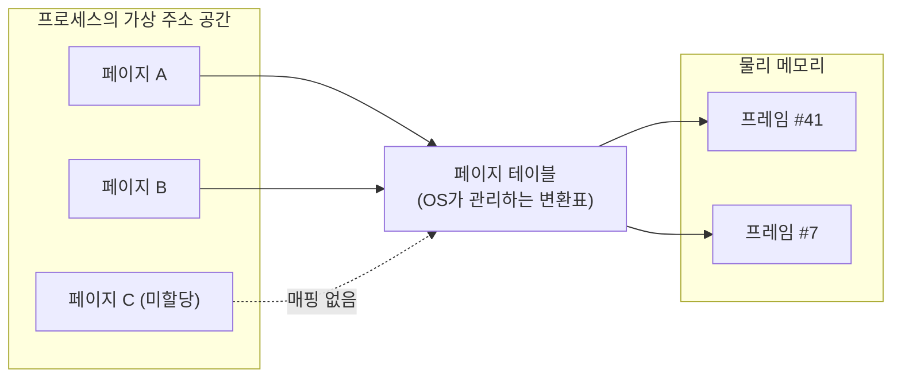

import RustPlay from '@components/RustPlay.astro';
import tlb from '@snippets/ch14/tlb.rs?raw';
import fault from '@snippets/ch14/fault.rs?raw';

이 장에서 알 수 있는 것:

- 프로그램이 사용하는 주소가 실제 물리 주소가 아니라 가상 주소라는 점과 페이지 테이블의 변환 방식
- TLB — 주소 변환 결과를 저장하는 캐시와 TLB 미스 비용, 실제 측정에서 약 1.9배 차이
- "메모리를 할당한다"는 것과 "실제 물리 메모리를 사용한다"는 것이 다른 이유
  — 요구 페이징과 첫 접근 시 약 220배 차이
- hugepages, copy-on-write, mmap이 가상 메모리 구조에서 어떤 역할을 하는지
- 왜 이 내용이 중요한지 — [2장](/cpu/02-memory-hierarchy/)의 캐시 계층은
  사실 주소 변환이라는 또 하나의 계층 위에서 동작합니다.
  이 장을 알아야 메모리 접근 비용의 전체 구조를 이해할 수 있습니다

## 메모리 주소는 두 종류가 있습니다

지금까지 "메모리 주소"라고 부른 Rust의 참조와 포인터 값은
실제 DRAM의 물리적인 위치가 아닙니다.
프로그램이 보는 것은 **가상 주소**(virtual address)이고,
CPU와 운영체제가 협력해 메모리에 접근할 때마다 이를 **물리 주소**(physical address)로 변환합니다.
이 전체 구조를 **가상 메모리**(virtual memory)라고 부릅니다.

굳이 이렇게 한 단계를 더 거치는 이유는 크게 세 가지입니다.

- **격리** — 프로세스마다 서로 다른 변환 테이블을 사용하면 다른 프로세스의 메모리는
  자신의 주소 공간에 존재하지 않으므로 원칙적으로 접근할 수 없습니다
- **연속된 공간처럼 보이게 하기** — 실제 물리 메모리가 여러 곳으로 나뉘어 있어도
  가상 주소 공간에서는 거대한 연속 배열을 만들 수 있습니다.
  `Vec`이 큰 연속 메모리를 사용할 수 있는 배경에도 이 구조가 있습니다
- **실체화를 늦추고 공유하기** — 뒤에서 살펴보듯이 할당만 해 두고 실제 물리 메모리는 나중에 붙이거나,
  하나의 물리 메모리를 여러 프로세스가 공유하는 방식이 가능합니다

주소 변환은 **페이지**(page)라는 고정 크기 단위로 이루어집니다.
대표적인 페이지 크기는 4KB이고 Apple Silicon은 16KB를 사용합니다.
전체 흐름은 다음과 같습니다.

## 페이지 테이블과 페이지 워크

주소 변환표인 **페이지 테이블**(page table)은 운영체제가 메모리에 만드는 자료구조이며,
CPU의 **MMU**(memory management unit)가 이를 참조합니다.

64비트 가상 주소 공간은 매우 크기 때문에 페이지 테이블을 한 장짜리 거대한 배열로 만들지 않고
여러 단계의 트리 구조로 구성합니다.
x86-64에서는 일반적으로 4단계를 사용하며 더 넓은 가상 주소 공간을 위한 5단계 확장을 지원하는 CPU도 있습니다.
따라서 주소 변환 한 번이 최악의 경우 **메모리 읽기 네 번**을 필요로 할 수 있습니다.
각 단계의 테이블을 하나씩 따라가는 이 과정을 **페이지 워크**(page walk)라고 부릅니다.

2장에서 배운 메모리 지연 시간을 생각하면 상당히 비싼 작업입니다.
로드 한 번마다 추가 메모리 접근 네 번을 실제로 수행한다면 성능이 크게 떨어질 것입니다.
그래서 CPU는 주소 변환에도 별도의 캐시를 사용합니다.

## TLB — 주소 변환 결과를 저장하는 캐시

**TLB**(translation lookaside buffer)는 최근 사용한
"가상 페이지 → 물리 프레임" 변환 결과를 저장하는 MMU 전용 캐시입니다.
대략적인 규모는 다음과 같습니다.

- L1 TLB: 수십~백여 개 엔트리
- L2 TLB: 약 1,500~3,000개 엔트리

간단히 계산해 보겠습니다. 3,000개 엔트리 × 4KB 페이지라면
TLB가 한 번에 덮을 수 있는 주소 범위는 **약 12MB**입니다.
L3 캐시보다도 작은 범위일 수 있습니다.
즉 데이터가 캐시에 들어 있어도 주소 변환 정보가 TLB에 없는 상황이 충분히 생깁니다.

실험으로 확인해 보겠습니다. 256MB 영역에서 같은 횟수만큼 메모리를 읽습니다.
첫 번째는 64바이트 간격으로 접근합니다. 매번 다른 캐시 라인을 읽지만 페이지는 64번에 한 번 정도만 바뀝니다.
두 번째는 약 4KB 간격으로 접근합니다. 매번 다른 캐시 라인에 접근하면서 **매번 다른 페이지**로 이동합니다.

<RustPlay code={tlb} mode="release" title="캐시 라인만 넘기기 vs 페이지까지 넘기기" />

저자가 Playground에서 측정했을 때 64바이트 간격은 약 14밀리초,
4KB 간격은 약 27밀리초였습니다.
**접근한 캐시 라인 수는 같은데 페이지를 매번 바꾸면 약 1.9배 느렸습니다.**
추가 비용의 주요 원인은 TLB 미스와 페이지 워크입니다.

다만 스트라이드가 커지면 하드웨어 프리페치가 동작하는 방식도 달라지므로 그 영향이 일부 섞여 있습니다.
Linux에서는 `perf stat -e dTLB-load-misses`로 TLB 미스 자체를 직접 확인할 수 있습니다.

대응 방법은 2장의 결론과 같습니다. **지역성**을 높이는 것입니다.
데이터를 작고 가깝게 배치하면 캐시뿐 아니라 TLB에도 유리합니다.
또 하나의 방법은 페이지 크기 자체를 키우는 것입니다.

## hugepages — 더 큰 페이지 사용하기

많은 CPU는 기본 4KB 페이지 외에 **2MB**나 **1GB** 크기의 페이지를 지원합니다.
이를 **hugepages**라고 부릅니다.
단순 계산으로 3,000개의 TLB 엔트리가 모두 2MB 페이지를 가리킨다면 약 6GB의 주소 공간을 덮을 수 있습니다.
실제 대형 페이지용 TLB 구성은 CPU마다 다르므로 정확한 범위는 이보다 작을 수도 있습니다.

대량의 메모리를 순회하는 데이터베이스나 과학 계산에서는 hugepages가 자주 사용됩니다.
Linux에는 조건이 맞는 메모리 영역을 자동으로 2MB 페이지로 묶는
**THP**(transparent huge pages) 기능도 있습니다.
Rust 프로그램 역시 별도의 설정 없이 이 기능의 도움을 받을 수 있습니다.

직접 제어하려면 `madvise` 시스템 호출이나 hugepage를 지원하는 할당자를 사용할 수 있습니다.
다만 메모리 단편화나 지연 시간의 변동 같은 부작용도 있으므로 실제 효과는 측정해서 판단해야 합니다.

## "할당"했다고 바로 물리 메모리를 쓰는 것은 아닙니다 — 요구 페이징

가상 메모리의 중요한 특징 중 하나입니다.
**큰 메모리 영역을 새로 할당해도 그 순간 같은 크기의 물리 메모리가 바로 사용되는 것은 아닙니다.**
운영체제는 페이지 테이블에 해당 가상 주소 영역을 기록해 두고,
실제로 페이지가 처음 사용될 때 물리 프레임을 연결할 수 있습니다.
이 방식을 **요구 페이징**(demand paging)이라고 부릅니다.

정확히는 Linux에서 읽기만 하는 경우 공유된 제로 페이지가 사용될 수 있고,
실제 쓰기가 일어나는 시점에 개별 물리 프레임이 할당됩니다.
또 할당자가 이미 확보한 메모리 영역을 재사용하는 경우에는 동작이 다를 수 있습니다.

아직 물리 프레임이 연결되지 않은 페이지에 접근하면 CPU가 예외를 발생시키고
운영체제가 물리 페이지를 준비한 뒤 해당 명령을 다시 실행합니다.
이 과정을 **페이지 폴트**(page fault)라고 부릅니다.
디스크 읽기가 필요하지 않은 경우를 minor fault,
디스크에서 데이터를 가져와야 하는 경우를 major fault라고 합니다.

실험에서 네 가지 시간을 비교해 보겠습니다.

<RustPlay code={fault} mode="release" title="할당, 첫 접근, 두 번째 접근 시간 측정" />

저자가 Playground에서 측정한 결과는 다음과 같습니다.

- `vec![0u8; 128MB]` 할당: **약 6마이크로초** — 실제 128MB를 6µs 안에 초기화한 것이 아닙니다.
  운영체제가 나중에 0으로 된 페이지를 제공할 수 있도록 주소 공간만 준비한 것입니다.
  0으로 초기화하는 `Vec`는 이 최적화를 활용할 수 있도록 `calloc`에 가까운 경로를 사용합니다
- `vec![1u8; 128MB]` 할당: **약 75밀리초** — 모든 바이트를 1로 채우려면 실제 모든 페이지에 써야 하므로
  이 과정에서 물리 메모리가 실제로 할당됩니다
- 0으로 초기화한 버퍼에 첫 번째 쓰기(4KiB 간격): **약 73밀리초** —
  32,768개 페이지에서 페이지 폴트가 발생하는 비용입니다. Playground에서는 4KiB 페이지를 사용했습니다
- 같은 위치에 두 번째 쓰기: **약 0.3밀리초** — **약 220배 차이**입니다.
  이미 물리 페이지가 준비된 뒤의 실제 접근 속도입니다

실무에서는 다음 세 가지가 중요합니다.

- **프로그램 시작 직후가 느릴 수 있습니다.** 서버의 첫 요청 몇 개가 느린 이유 중 하나가 페이지 폴트입니다.
  캐시 워밍업이나 JIT 같은 다른 원인도 있을 수 있습니다
- **벤치마크의 워밍업**([8장](/rust-opt/08-measure/))은 페이지 폴트 비용을 미리 지불하는 효과도 있습니다.
  criterion이 초기 실행을 측정에서 제외하는 이유 중 하나입니다
- 운영체제가 보여 주는 메모리 사용량에 가상 크기와 실제 상주 메모리(RSS)가 따로 있는 이유가 바로 이 차이입니다.
  또한 `drop`으로 메모리를 해제해도 할당자가 즉시 운영체제에 돌려주지 않을 수 있어서 RSS가 바로 줄어들지 않을 수도 있습니다

## Copy-on-Write와 mmap

요구 페이징과 같은 아이디어를 활용하는 대표적인 기술이 두 가지 더 있습니다.

**Copy-on-Write**(COW)는 처음에는 같은 물리 메모리를 공유하다가
어느 한쪽이 값을 쓰는 순간에만 해당 페이지를 복사하는 방식입니다.
Unix의 `fork`가 빠르게 동작할 수 있는 이유도 부모와 자식 프로세스가 처음에는 물리 메모리를 공유하고,
실제로 수정한 페이지에서만 복사가 발생하기 때문입니다.
Rust 표준 라이브러리의 `Cow` 타입이나 `Arc::make_mut`도 같은 발상을 사용자 공간 자료구조에 적용한 예라고 볼 수 있습니다.

**mmap**(memory map)은 파일을 가상 주소 공간에 연결하는 시스템 호출입니다.
실제로 접근한 페이지에 대해서만 디스크에서 데이터를 가져오는 요구 페이징의 응용입니다.
매우 큰 파일의 일부 영역만 사용하는 상황에서 특히 유용합니다.
일반적인 `read` 계열 I/O와의 차이는 [27장](/systems/27-os-layer/)에서 직접 측정합니다.

## 정리

- 프로그램이 사용하는 주소는 가상 주소이며 페이지 단위의 페이지 테이블을 통해 물리 주소로 변환됩니다
- 주소 변환 결과를 저장하는 캐시가 TLB입니다. 4KB 페이지 기준으로 덮을 수 있는 범위가 수십 MB 이하일 수 있으며,
  페이지를 계속 넘나드는 접근은 실험에서 약 1.9배 느렸습니다. 지역성과 hugepages가 대응 방법입니다
- 메모리 할당은 물리 메모리를 즉시 사용하는 것과 다릅니다.
  실제 물리 페이지는 처음 접근할 때 페이지 폴트를 통해 준비될 수 있으며 실험에서는 첫 접근이 약 220배 느렸습니다
- COW와 mmap은 가상 메모리가 제공하는 지연 할당과 공유라는 원리를 활용한 기술입니다

다음 장에서는 다시 캐시로 돌아가 내부 구조를 더 깊게 살펴봅니다.
캐시 결합도, 세트 충돌, 캐시 블로킹을 통해
2장만으로는 설명하기 어려웠던 "특정 스트라이드에서만 이상하게 느려지는 이유"를 알아봅니다.