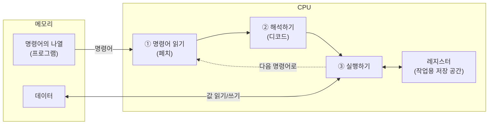

import RustPlay from '@components/RustPlay.astro';
import cpuSpeed from '@snippets/ch01/cpu-speed.rs?raw';

이 장에서 알 수 있는 것:

- Rust 코드가 기계어로 변환되어 CPU에서 실행되기까지의 흐름
- 레지스터란 무엇인지, CPU가 명령어를 실행하는 기본 사이클
- CPU의 계산이 얼마나 빠른지(실측)
- 컴파일러가 생성한 기계어를 직접 확인하는 방법

## CPU는 무엇을 하는 장치인가

**CPU**(central processing unit)는 본질적으로 단순한 장치입니다.
**메모리**(memory)에 놓인 **명령어**(instruction)를 차례로 읽어 실행하는
동작을 끊임없이 반복합니다.

명령어는 "이 수와 저 수를 더한다", "메모리의 이 위치에서 값을 읽는다"와 같은
아주 작은 연산을 지시합니다. 명령어는 `0`과 `1`의 나열로 표현되며,
이 형식을 **기계어**(machine code)라고 부릅니다.
프로그램은 기계어 명령어의 나열이며 데이터와 마찬가지로 메모리에 놓입니다.



현대 CPU는 이 그림의 사이클을 1초에 수십억 번 반복합니다.
이 책의 Part I에서는 이 단순한 사이클을 "어떻게 더 빠르게 만드는지"를
한 단계씩 살펴봅니다.

## Rust 코드가 기계어가 되기까지

Rust 소스 코드는 컴파일러(`rustc`)에 의해 기계어로 변환됩니다.
`cargo build`로 얻는 실행 파일의 내용은 대부분 기계어 명령어의 나열입니다.

기계어는 숫자의 나열이라 사람이 읽기 어렵습니다. 그래서 각 명령어를 사람이 읽을 수 있는
표기법으로 바꾼 **어셈블리**(assembly)를 사용합니다.
기계어와 어셈블리는 일대일로 대응하므로, "기계어를 읽는다"는 것은
실질적으로 "어셈블리를 읽는다"는 뜻으로 생각해도 무방합니다.

다음 함수가 어떤 기계어로 바뀌는지 살펴보겠습니다.

```rust
pub fn add(a: i32, b: i32) -> i32 {
    a + b
}
```

x86-64(Intel이나 AMD CPU)용으로 컴파일하면 어셈블리는 다음과 같습니다.

```asm
add:
	lea	eax, [rdi + rsi]
	ret
```

명령어는 단 두 개뿐입니다. 한 줄씩 읽어 보겠습니다.

- `lea eax, [rdi + rsi]` — 레지스터 `rdi`와 `rsi`의 값을 더한 뒤 결과를 레지스터 `eax`에 넣습니다
- `ret` — 함수에서 돌아갑니다

명령어 이름(`lea`, `ret`) 뒤에 오는 `eax`나 `[rdi + rsi]`처럼
"명령어가 조작하는 대상"을 **피연산자**(operand)라고 부릅니다.
피연산자가 될 수 있는 것은 레지스터, 명령어에 포함된 상수,
메모리 위치 등이며, 어떤 피연산자를 몇 개 받을 수 있는지는 명령어마다 정해져 있습니다.

인자 `a`와 `b`는 각각 레지스터 `rdi`와 `rsi`에 담겨 전달되고,
반환값은 레지스터 `eax`에 담아 돌려주기로 약속되어 있습니다.
이 약속을 **호출 규약**(calling convention)이라고 부릅니다.
여기서는 macOS와 Linux의 x86-64에서 사용하는 규약(System V)을 기준으로 설명합니다
(Windows에서는 다른 레지스터를 사용합니다).
어느 경우든 Rust의 `a + b`는 CPU의 단 하나의 덧셈 명령어에 대응합니다.

같은 함수를 ARM64(Apple Silicon이나 스마트폰 CPU)용으로
컴파일하면 다음과 같습니다.

```asm
add:
	add	w0, w1, w0
	ret
```

명령어 표기는 다르지만 "두 레지스터를 더해 결과를 레지스터에 넣고 돌아간다"는
구조는 같습니다. CPU가 받아들이는 명령어의 종류와 형식을
**명령어 집합 아키텍처**(instruction set architecture, ISA)라고 부릅니다.
x86-64와 ARM64가 대표적인 ISA입니다. 컴파일러는 같은 Rust 코드에서도
명령어 집합에 따라 서로 다른 기계어를 생성합니다.

:::note[lea가 덧셈에 쓰이는 이유]
`lea`는 원래 주소 계산용 명령어입니다. 하지만 "두 레지스터의 합을
다른 레지스터에 쓸 수 있다"는 특성 때문에 x86-64에서는 단순한 덧셈에도 자주 쓰입니다.
어셈블리를 읽다 보면 이런 식으로 명령어를 다른 용도로 활용하는 경우가 종종 나옵니다.
:::

:::note[ARM64 버전에서 w0가 두 번 등장하는 이유]
`add w0, w1, w0`에서는 `w0`가 계산의 입력과 출력 위치를
동시에 맡습니다. ARM64의 호출 규약에서는 **첫 번째 인자의 레지스터와
반환값 레지스터를 모두 `x0`(32비트 폭이라면 `w0`)로 정하기 때문**입니다.
명령어는 두 입력을 모두 읽은 뒤 결과를 쓰므로, 인자 `a`를
결과로 덮어써도 문제가 없습니다(`a`는 이 덧셈 이후에는 더 이상 필요하지 않다는
판단은 레지스터 할당 단계에서 이루어집니다).

확인해 보면, 첫 번째 인자를 그대로 반환하는 함수는 ARM64에서 `ret` 단 하나의 명령어가 됩니다.
값이 처음부터 반환값 위치에 있으므로 옮길 필요가 없기 때문입니다.
반면 두 번째 인자를 반환하는 함수에는 `mov x0, x1`이라는 이동이 나타납니다.

```rust
pub fn first(a: i32, _b: i32) -> i32 { a }  // → ret만 사용
pub fn second(_a: i32, b: i32) -> i32 { b } // → mov x0, x1 / ret
```

x86-64는 이 점에서 대조적입니다. 반환값 레지스터 `eax`는 인자 레지스터가
아니므로 결과를 반드시 `eax`로 옮겨야 합니다. 앞에서 `lea`를 활용한 것은
"3피연산자 덧셈으로 값 이동과 계산을 한 명령어에서 끝내기 위한" 방법이기도 합니다.
:::

## 레지스터 — CPU 내부의 저장 공간

앞에서 계속 등장한 **레지스터**(register)는 CPU 내부에 있는 소수의
고속 저장 공간입니다. 예를 들면 책상 위에 바로 펼쳐 놓을 수 있는 몇 장의 메모지와 비슷합니다.
수는 적지만 멀리 손을 뻗을 필요 없이 즉시 읽고 쓸 수 있습니다.

- x86-64에는 64비트 범용 레지스터가 16개 있습니다(`rax`, `rdi`, `rsi` 등.
  `eax`는 `rax`의 하위 32비트를 가리키는 이름입니다)
- ARM64에는 31개가 있습니다(`x0`~`x30`. `w0`는 `x0`의 하위 32비트입니다)

CPU의 계산 명령어는 주로 레지스터(또는 명령어에 포함된 상수)를 대상으로 합니다.
ARM64에서는 메모리에 있는 데이터를 계산에 사용하려면 반드시 로드 명령어로 레지스터에
읽어 와야 합니다. x86-64에는 메모리 값을 직접 더하는 형태의 명령어도 있지만,
내부에서는 이 경우에도 값을 로드한 다음 계산합니다.

그래서 컴파일러는 자주 사용하는 변수를 가능한 한 레지스터에 할당하려고 합니다.
Rust 코드에서 `let x = ...`라고 적었다고 해서 `x`가 반드시 메모리에 놓이는 것은 아닙니다.
대부분의 경우 `x`는 레지스터 안에서만 생겼다가 사라집니다.
이렇게 "변수를 어느 레지스터에 배치할지" 정하는 작업을 **레지스터 할당**
(register allocation)이라고 부르며, 컴파일러의 중요한 작업 중 하나입니다.

## 명령어 사이클과 클록

CPU가 하나의 명령어를 처리하는 흐름은 크게 세 단계로 나눌 수 있습니다.

1. **페치**(fetch) — 메모리에서 다음 명령어를 읽습니다
2. **디코드**(decode) — 명령어의 종류와 대상(어느 레지스터인지 등)을 해석합니다
3. **실행**(execute) — 계산이나 메모리 접근을 수행하고 결과를 레지스터 등에 기록합니다

이 흐름의 박자를 정하는 것이 **클록 주파수**(clock frequency)입니다.
예를 들어 3GHz CPU는 1초에 30억 번의 "박자"를 만듭니다.
한 박자(1사이클)는 약 0.33나노초입니다. 정수 덧셈 같은 단순한 명령어는
대략 1사이클에 실행할 수 있습니다.

## 실험: CPU의 속도를 체감하기

이제 실제로 측정해 보겠습니다.
다음 코드는 1억 번 덧셈을 수행하고 걸린 시간을 출력합니다.
코드의 `wrapping_add`는 "오버플로가 발생하면 2^64를 기준으로 다시 돌아가는 덧셈"입니다.
일반적인 `+`는 debug 빌드에서 오버플로를 오류로 처리하는 검사를 추가합니다.
따라서 "값이 순환해도 된다"고 명시해 뒤에서 비교할 두 빌드의 조건을 맞춥니다.
"▶ 실행"을 눌러 보세요(Rust Playground에서 실행됩니다).

<RustPlay code={cpuSpeed} title="1억 번 덧셈(최적화 없음: debug 빌드)" />

Playground에서는 1초보다 조금 짧은 시간, 초당 1억 회를 조금 넘는 속도로 실행될 것입니다
(공유 환경이므로 실행할 때마다 값은 달라질 수 있습니다).

여기서 의문이 생깁니다. 3GHz급 CPU라면 1초에 30억 사이클이 있는데,
왜 초당 1억 번 정도밖에 덧셈하지 못할까요?

이유는 이것이 **debug 빌드**(최적화하지 않은 컴파일)이기 때문입니다.
debug 빌드에서는 컴파일러가 변수 `sum`과 `i`를 그대로 메모리에 두고
루프를 돌 때마다 읽고 씁니다. 덧셈 한 번을 처리하기 위해
실제로는 수십 개의 명령어가 실행됩니다.

이번에는 최적화를 활성화한 **release 빌드**에서 같은 코드를 실행해 보겠습니다.

<RustPlay code={cpuSpeed} mode="release" title="같은 코드(최적화 있음: release 빌드)" />

실행 시간은 수백 나노초 정도이고, "초당 수천조 번의 덧셈"이라는
물리적으로 불가능한 숫자가 표시될 것입니다.

이유를 살펴보면, 컴파일러는 이 루프를 보고
"`0`부터 `n-1`까지의 합은 공식으로 계산할 수 있다"고 판단합니다.
그래서 **루프 자체를 제거하고** 몇 번의 곱셈과 덧셈으로 바꿉니다.
1억 번의 덧셈은 실행 시점에는 한 번도 일어나지 않습니다.

이 실험을 통해 이 책 전체를 관통하는 두 가지 사실을 알 수 있습니다.

- **성능을 이야기할 때는 release 빌드가 전제입니다.** debug 빌드의 실행 시간은 성능 비교 기준으로 의미가 없습니다
- **컴파일러는 작성한 코드를 그대로 옮기는 장치가 아닙니다.**
  의미를 유지하면서 코드를 크게 바꿉니다. 그 원리는
  [6장 컴파일러가 하는 일](/rust-opt/06-compiler/)에서 다룹니다

## 생성된 기계어를 직접 확인하려면

컴파일러가 무엇을 했는지는 추측할 필요 없이 생성된 어셈블리를 보면 확인할 수 있습니다.
간단한 방법 두 가지를 소개합니다.

- [Compiler Explorer](https://godbolt.org/) — 브라우저에서 코드를 작성하면
  생성되는 어셈블리를 바로 보여 주는 사이트입니다. 언어로 Rust를 선택하고,
  컴파일러 옵션에 `-O`(최적화 활성화)를 지정하면 됩니다
- `cargo asm` — 로컬 프로젝트에 있는 함수의 어셈블리를 표시하는
  cargo 서브커맨드입니다([8장](/rust-opt/08-measure/)에서 소개합니다)

이 책에서도 "정말 그렇게 동작하는지"를 어셈블리로 확인하는 장면이
여러 번 나옵니다.

## 정리

- CPU는 "메모리에서 명령어를 페치 → 디코드 → 실행"하는 과정을 반복하는 장치입니다
- 프로그램은 기계어 명령어의 나열로 메모리에 놓입니다.
  어셈블리는 사람이 읽을 수 있도록 기계어를 표현한 형태입니다
- 레지스터는 CPU 내부에 있는 소수의 고속 저장 공간이며, 계산은 원칙적으로 레지스터에서 이루어집니다
- 단순한 덧셈은 명령어 하나, 약 1사이클입니다. 3GHz CPU는 1초에 30억 사이클을 만듭니다
- debug 빌드와 release 빌드의 성능은 완전히 다릅니다.
  컴파일러는 루프를 없앨 만큼 과감하게 코드를 바꿀 수 있습니다

CPU는 1초에 수십억 번 계산할 수 있습니다. 하지만 계산할 데이터가
메모리에서 도착하지 않으면 CPU는 기다릴 수밖에 없습니다.
현대 프로그램의 속도를 크게 좌우하는 것은 사실 이 "기다림"입니다.
다음 장에서는 메모리와 캐시의 원리를 살펴봅니다.