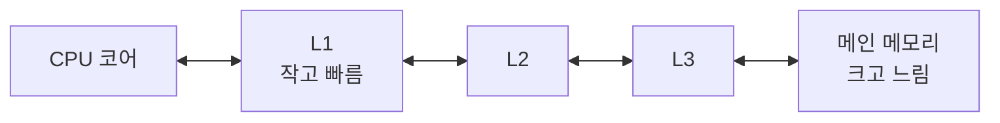

import RustPlay from '@components/RustPlay.astro';
import stride from '@snippets/ch02/stride.rs?raw';
import random from '@snippets/ch02/random.rs?raw';
import list from '@snippets/ch02/list.rs?raw';
import layout from '@snippets/ch02/layout.rs?raw';

이 장에서 알 수 있는 것:

- 메모리 읽기와 쓰기가 왜 CPU의 계산보다 훨씬 느린지
- 캐시와 캐시 라인이 어떻게 동작하는지
- 캐시를 효과적으로 활용하기 위한 조건인 "지역성"
- `Vec`과 `LinkedList`의 속도 차이와 구조체 레이아웃이 성능에 영향을 주는 이유

## CPU에서 보면 메모리는 멀리 있습니다

앞 장 마지막에서 "데이터가 도착하지 않으면 CPU는 기다릴 수밖에 없다"고 설명했습니다.
얼마나 오래 기다리는지 숫자로 확인해 보겠습니다.

메인 메모리에 사용하는 **DRAM**(dynamic RAM)은
읽기 요청을 보낸 뒤 값이 도착하기까지 대략 100나노초가 걸립니다.
3GHz CPU에서 100나노초는 약 300사이클입니다.
1사이클이면 끝나는 덧셈보다 약 300배 오래 걸립니다.

1장의 비유를 이어가면, 레지스터가 책상 위에 놓인 메모지라면
메인 메모리는 다른 층에 있는 자료실과 비슷합니다.
저장할 수 있는 양은 훨씬 많지만, 값을 가져올 때마다 먼 거리를 오가야 합니다.

여기서 두 용어를 구분해 두겠습니다.

- **지연 시간**(latency) — 요청한 뒤 첫 번째 결과가 도착하기까지 걸리는 시간
- **대역폭**(bandwidth) — 단위 시간에 전송할 수 있는 데이터의 양

메모리에서 특히 문제가 되는 것은 지연 시간입니다. DRAM의 대역폭은 초당 수십GB로 크지만,
"첫 번째 값이 도착하기까지 오래 걸리는" 것이 문제입니다.

## 캐시 — 작고 빠른 메모리를 중간에 둡니다

매번 300사이클씩 기다려야 한다면 CPU가 아무리 빨라도 효과를 내기 어렵습니다.
그래서 CPU는 **캐시**(cache)라는 작고 빠른 메모리를
CPU 칩 안에 두고 최근에 사용한 데이터의 복사본을 저장합니다.
캐시에는 가격이 비싸지만 빠른 **SRAM**(static RAM)을 사용합니다.

많은 CPU의 캐시는 세 단계로 구성되며 CPU에 가까운 순서대로 L1, L2, L3라고 부릅니다
(L은 level의 약자입니다). 최근의 일반적인 x86-64 CPU를 기준으로 대략적인 수치를 보면 다음과 같습니다
(단계 수, 용량, 공유 방식은 CPU 모델마다 다릅니다).

| 저장 위치 | 대략적인 용량 | 대략적인 지연 시간 |
| --- | --- | --- |
| 레지스터 | 수백 바이트 | —(연산 장치 바로 옆) |
| L1 캐시 | 32~64KB | 약 4사이클 |
| L2 캐시 | 256KB~2MB | 약 12사이클 |
| L3 캐시 | 수MB~수십MB | 약 40사이클 |
| 메인 메모리(DRAM) | 수GB~ | 약 200~400사이클 |

이 계층 구조를 그림으로 나타내면 다음과 같습니다.



CPU가 데이터를 읽을 때는 먼저 L1을 찾고, 없으면 L2와 L3를 거쳐
마지막으로 메인 메모리까지 내려갑니다. 원하는 데이터가 캐시에
있는 상태를 **캐시 히트**(cache hit), 없는 상태를
**캐시 미스**(cache miss)라고 부릅니다.
L1에서 계속 히트한다면 메모리는 거의 레지스터에 가까울 정도로 빠르게 느껴집니다.
캐시 미스가 발생할 때마다 더 아래 계층의 지연 시간을 부담합니다.

이 과정은 모두 하드웨어가 자동으로 처리합니다.
프로그램에서 직접 "이 데이터를 캐시에 넣어라"라는 명령어를 작성하는 것은 아닙니다.
프로그래머가 할 수 있는 일은 **캐시가 잘 동작하도록 데이터를 배치하고
접근 방식을 선택하는 것**입니다. 이 장의 나머지 부분에서는 그 방법을 살펴봅니다.

## 캐시 라인 — 데이터는 64바이트 단위로 전송됩니다

캐시와 메모리 사이에서 데이터는 1바이트씩 전송되지 않습니다.
**캐시 라인**(cache line)이라는 고정된 크기의 묶음 단위로 전송됩니다.
x86-64에서는 64바이트가 일반적입니다(Apple Silicon을 포함한 일부 ARM64 CPU는
128바이트 캐시 라인을 사용하기도 합니다). 이후 설명에서는 64바이트를 기준으로 합니다.

따라서 `data[0]`처럼 `u64` 값 하나(8바이트)만 읽더라도
그 주변을 포함한 64바이트, 즉 `u64` 8개 분량이 한꺼번에 캐시에 들어옵니다.
다음 그림이 이 과정을 보여 줍니다.

<figure class="book-figure">
  <svg viewBox="0 0 640 150" role="img" aria-label="배열과 캐시 라인의 관계를 보여 주는 그림">
    <style>{`
      .cell { fill: none; stroke: var(--sl-color-gray-4); }
      .cell-hot { fill: var(--sl-color-accent-low); stroke: var(--sl-color-accent); }
      .lbl { fill: var(--sl-color-gray-3); font-size: 12px; }
      .lbl-strong { fill: var(--sl-color-white); font-size: 13px; }
      .brace { stroke: var(--sl-color-accent); fill: none; stroke-width: 1.5; }
    `}</style>
    <text x="8" y="20" class="lbl-strong">메모리의 u64 배열</text>
    {Array.from({ length: 16 }, (_, i) => (
      <rect
        x={8 + i * 39}
        y={32}
        width={39}
        height={34}
        class={i < 8 ? 'cell-hot' : 'cell'}
      />
    ))}
    {Array.from({ length: 16 }, (_, i) => (
      <text x={8 + i * 39 + 12} y={54} class="lbl">
        {i}
      </text>
    ))}
    <path d="M 8 78 L 8 92 L 320 92 L 320 78" class="brace" />
    <text x="90" y="112" class="lbl-strong">라인 0 (64바이트)</text>
    <path d="M 320 78 L 320 92 L 632 92 L 632 78" class="brace" style="stroke: var(--sl-color-gray-4)" />
    <text x="410" y="112" class="lbl">라인 1 (64바이트)</text>
    <text x="8" y="140" class="lbl">data[2] 읽기 → 라인 0 전체(data[0]~data[7])가 캐시에 들어옴</text>
  </svg>
  <figcaption>
    캐시 전송은 64바이트 라인 단위로 이루어집니다. 값 하나를 읽어도 주변 데이터가 함께 들어옵니다
  </figcaption>
</figure>

실험으로 확인해 보겠습니다. 캐시보다 충분히 큰 64MB 배열에서
"모든 원소를 읽는 경우"와 "8개마다 하나씩 읽는 경우"를 비교합니다.
두 번째 경우에는 읽는 횟수가 8분의 1이므로 단순히 생각하면 실행 시간도
8분의 1로 줄어들 것 같지만, 실제 결과는 다릅니다.

<RustPlay code={stride} mode="release" title="읽는 횟수를 1/8로 줄이면 시간도 1/8이 될까?" />

저자가 Playground에서 측정했을 때 모든 원소를 읽는 경우는 약 3.7밀리초,
8개마다 하나씩 읽는 경우는 약 5.5밀리초였습니다. 읽는 횟수를 8분의 1로 줄였지만
**빨라지지 않았고 오히려 더 느려졌습니다**.

이유는 다음과 같습니다. `u64`는 8바이트이므로 8개마다 접근하면
"64바이트마다 한 번" 접근하게 됩니다. 즉 **모든 캐시 라인에 접근합니다**.
메모리에서 가져오는 캐시 라인의 수는 모든 원소를 읽을 때와 같습니다.
이 실험의 실행 시간을 결정하는 것은 CPU의 덧셈 횟수가 아니라
메모리에서 전송한 캐시 라인의 수입니다.

연속 접근에는 두 가지 이점도 있습니다.
첫 번째는 **프리페치**(prefetch)입니다. CPU는 데이터가 순서대로 읽히는
패턴을 감지하면 실제 요청이 오기 전에 다음 캐시 라인을 미리 읽어
지연 시간을 숨깁니다. 두 번째는 SIMD 명령어를 이용한 일괄 처리이며,
이는 [4장](/cpu/04-simd/)에서 다룹니다.

## 지역성 — 캐시가 잘 동작하는 조건

지금까지의 구조를 프로그램 관점에서 보면,
캐시가 잘 동작하는 코드는 두 가지 조건으로 정리할 수 있습니다.

- **공간 지역성**(spatial locality) — 방금 사용한 데이터와 가까운 데이터를 이어서 사용합니다.
  같은 캐시 라인에 들어 있는 데이터는 추가 전송 없이 읽을 수 있습니다
- **시간 지역성**(temporal locality) — 같은 데이터를 짧은 간격으로 반복해 사용합니다.
  캐시에서 밀려나기 전이라면 다시 빠르게 읽을 수 있습니다

반대로 캐시가 가장 효과를 내기 어려운 경우는 "다음에 어디를 읽을지 예측할 수 없는"
접근입니다. 이것도 실험으로 확인해 보겠습니다. 같은 64MB 배열을 같은 횟수만큼 순회하되,
접근 순서만 "순차"와 "무작위"로 바꿉니다.

<RustPlay code={random} mode="release" title="같은 배열·같은 횟수, 순서만 바꾸기" />

저자가 Playground에서 측정했을 때 순차 접근은 약 25밀리초, 무작위 접근은 약 1.7초였습니다.
**약 70배의 차이**입니다. 무작위 접근은 한 번당 약 110나노초가 걸렸습니다.
이는 앞에서 설명한 DRAM의 지연 시간이 거의 그대로 드러나는 수준입니다.

이 코드에서는 다음에 읽을 위치가 `next[pos]`, 즉
**현재 읽기의 결과를 확인하기 전까지는 알 수 없도록** 되어 있습니다.
이런 접근 패턴을 **포인터 체이싱**(pointer chasing)이라고 부릅니다.
다음 위치를 예측할 수 없으므로 프리페치가 동작하지 않고,
접근할 때마다 메모리의 지연 시간을 그대로 부담합니다.

## Vec과 LinkedList의 실제 차이

포인터 체이싱을 대표적으로 사용하는 자료구조가 연결 리스트입니다.
`LinkedList`의 각 노드는 힙의 서로 다른 위치에 할당되며,
다음 노드로 이동하려면 포인터를 따라가야 합니다.

<RustPlay code={list} mode="release" title="100만 원소의 합계: Vec vs LinkedList" />

저자가 Playground에서 측정했을 때 `Vec`은 약 0.4밀리초,
`LinkedList`는 약 3밀리초가 걸려 6배 이상의 차이가 났습니다.
`Vec`은 모든 원소가 메모리에 연속으로 배치되므로
공간 지역성을 최대한 활용할 수 있습니다.

게다가 이 실험은 `LinkedList`에 유리한 조건입니다. 모든 노드를 한꺼번에 만들었기 때문에
우연히 메모리에서도 거의 연속된 위치에 놓입니다. 오래 실행되는 실제 애플리케이션에서는
노드가 메모리 곳곳에 흩어질 수 있으므로 차이가 더 커질 수 있습니다.

원소 삽입과 삭제가 많다는 이유만으로 연결 리스트를 선택하는 전통적인 판단은
현대 CPU에서는 대부분 `Vec`보다 느린 결과로 이어집니다.
[`LinkedList` 공식 문서](https://doc.rust-lang.org/std/collections/struct.LinkedList.html)에서도
거의 항상 `Vec`이나 `VecDeque`를 사용하는 편이 더 빠르다고 설명합니다.

## 구조체 레이아웃과 패딩

이제 데이터가 "어떻게 배치되는가"를 더 자세히 살펴보겠습니다.
구조체의 필드는 메모리에 어떤 식으로 놓일까요?

먼저 알아야 할 규칙이 **정렬**(alignment)입니다. 많은 CPU에서는
8바이트 값은 8의 배수 주소에 놓는 식으로, 타입마다
값을 배치할 수 있는 주소 단위가 정해져 있습니다. 이 규칙을 맞추기 위해
필드 사이에 추가되는 사용하지 않는 공간을 **패딩**(padding)이라고 부릅니다.

<RustPlay code={layout} mode="release" title="필드 배치와 크기" />

`u8 + u64 + u16`의 실제 데이터 크기를 합하면 11바이트지만,
결과는 16바이트와 24바이트가 됩니다(64비트 환경에서 측정한 결과입니다).

- `#[repr(C)]`(C 언어와 호환되는 배치)에서는 선언한 순서대로 필드를 놓습니다.
  따라서 `a: u8` 뒤에 7바이트, `c: u16` 뒤에 6바이트의 패딩이 들어가 전체 크기가 24바이트가 됩니다
- Rust의 기본 레이아웃에서는 컴파일러가 필드를 **재배치해** 패딩을 줄이고 16바이트에 맞춥니다.
  다만 기본 레이아웃의 결과는 언어 사양에서 보장하지 않으며 컴파일러 버전에 따라 달라질 수 있습니다.
  순서나 크기를 고정해야 할 때 `#[repr(C)]`를 사용합니다

원소 하나에서 8바이트 차이가 나면 100만 원소의 `Vec`에서는 16MB와 24MB의 차이가 됩니다.
같은 캐시 용량에 들어갈 수 있는 원소 수가 1.5배 차이 나는 셈입니다.

### 사용하는 필드만 연속으로 배치하기

구조체 배열에는 또 하나의 주의할 점이 있습니다.
일부 필드만 사용하는 순회에서도 사용하지 않는 필드까지
같은 캐시 라인에 실려 들어올 수 있다는 점입니다.

```rust
// AoS: 구조체의 배열 (Array of Structs)
struct Player {
    x: f32,
    y: f32,
    hp: u32,
    name: String, // 24바이트
}
let players: Vec<Player> = /* ... */;
// 좌표만 필요해도 hp와 name까지 캐시 라인에 함께 들어옵니다

// SoA: 배열을 필드로 가진 구조체 (Struct of Arrays)
struct Players {
    x: Vec<f32>,
    y: Vec<f32>,
    hp: Vec<u32>,
    name: Vec<String>,
}
// x만 순회하면 캐시 라인 64바이트 전체가 x 데이터로 채워집니다
```

첫 번째 형태를 **AoS**(array of structs), 두 번째 형태를 **SoA**(struct of arrays)라고 부릅니다.
좌표만 전체 순회하는 처리에서는 SoA의 캐시 라인 64바이트가 모두 필요한 데이터로 채워지므로
전송 효율을 높일 수 있습니다.
모든 데이터를 SoA로 만들어야 한다는 뜻은 아닙니다. "전체 순회에서 자주 접근하는 필드가
일부뿐인" 상황에서 고려할 수 있는 설계 방법입니다. SoA는 [4장의 SIMD](/cpu/04-simd/)와
[GPU 메모리](/gpu/10-gpu-memory/)에서도 매우 중요합니다.

## 정리

- 메인 메모리(DRAM)의 지연 시간은 약 100나노초로 CPU 덧셈보다 수백 배 깁니다
- CPU는 L1/L2/L3 캐시에 데이터 복사본을 두어 이 지연을 숨깁니다.
  데이터는 64바이트 캐시 라인 단위로 전송됩니다
- 캐시를 효과적으로 활용하는 핵심은 공간 지역성과 시간 지역성입니다.
  실험에서는 접근 순서만 바꿔도 약 70배의 차이가 나타났습니다
- `Vec`이 빠른 주요 이유는 데이터가 연속으로 배치되기 때문입니다.
  `LinkedList`는 포인터 체이싱을 반복합니다
- Rust 컴파일러는 필드를 재배치해 패딩을 줄일 수 있습니다.
  자주 접근하는 필드가 일부뿐이라면 SoA도 고려할 수 있습니다

캐시는 "데이터를 기다리는 시간"을 줄이는 장치였습니다.
다음 장에서는 CPU가 "명령어 처리" 자체를 여러 단계로 겹쳐 빠르게 만드는
파이프라인과 분기 예측을 살펴봅니다. 여기에서도 핵심은 "예측"입니다.