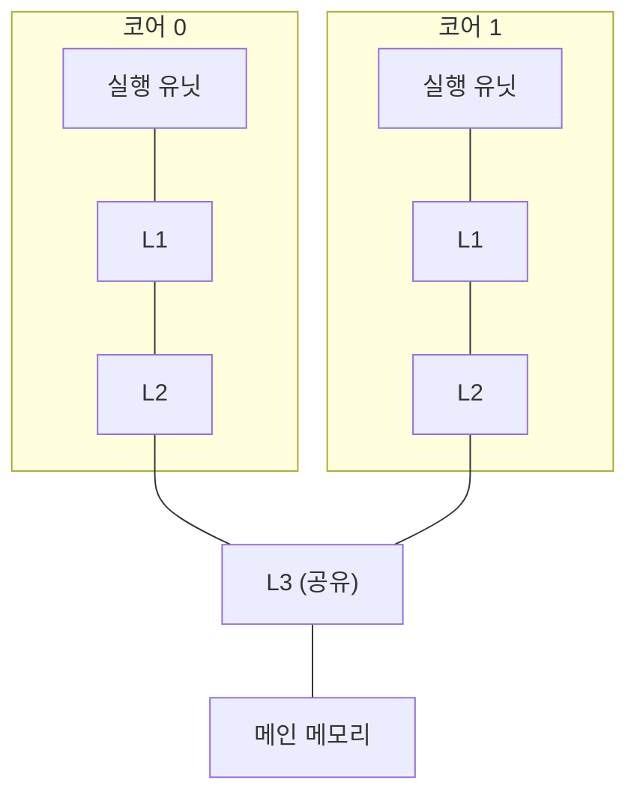

import RustPlay from '@components/RustPlay.astro';
import falseSharing from '@snippets/ch05/false-sharing.rs?raw';
import rayon from '@snippets/ch05/rayon.rs?raw';

이 장에서 알 수 있는 것:

- CPU에 여러 코어가 있는 이유와 코어별 캐시 구조
- 캐시 일관성과, "공유하지 않는데도 느려지는" 거짓 공유
- 데이터 레이스와 Rust가 이를 컴파일 시점에 막는 원리
- 원자적 연산과 메모리 오더링의 기초
- Rayon을 이용한 데이터 병렬화와 병렬화가 잘 확장되지 않는 세 가지 이유

## 코어가 늘어난 이유

2000년대 중반까지 CPU는 클록 주파수를 높이면서 계속 빨라졌습니다.
하지만 주파수가 높아질수록 소비 전력과 발열이 급격히 증가했고,
하나의 처리 장치를 계속 빠르게 만드는 방식은 한계에 도달했습니다.
그래서 방향이 바뀌었습니다. 같은 처리 장치를 여러 개 배치하는 방식입니다.

이 처리 장치 하나하나를 **코어**(core)라고 부릅니다.
각 코어는 1장부터 4장에서 살펴본 파이프라인, 캐시, SIMD 같은 구조를
각각 독립적으로 갖고 있으며 서로 다른 명령어 흐름을 동시에 실행할 수 있습니다.
현대 CPU는 노트북에서는 수 개에서 십여 개, 서버에서는 100개가 넘는 코어를 갖기도 합니다.

한 코어에서 두 개 이상의 명령어 흐름을 함께 실행하는 **SMT**
(simultaneous multithreading)라는 기술도 있습니다. Intel에서는 Hyper-Threading이라는 이름으로 알려져 있습니다.
이 때문에 운영체제에서는 "논리 코어" 수가 실제 물리 코어 수보다 많게 보일 수 있습니다.
Rust에서는 `std::thread::available_parallelism()`으로 이 값을 확인할 수 있습니다.

소프트웨어 쪽 용어도 정리해 두겠습니다. **스레드**(thread)는
운영체제가 관리하는 명령어 흐름의 단위이며 운영체제가 각 코어에 배치합니다.
여러 작업을 한 코어에서도 번갈아 진행할 수 있는 구조를 **동시성**(concurrency),
여러 코어에서 실제로 동시에 실행하는 것을 **병렬성**(parallelism)이라고 구분합니다.
이 장의 중심 주제는 병렬성입니다.

## 코어별 캐시와 캐시 일관성

2장에서 살펴본 캐시 계층은 멀티코어 CPU에서 다음과 같은 형태가 될 수 있습니다.
L1과 L2는 각 코어가 독립적으로 사용하고 L3는 모든 코어가 공유하는,
흔히 볼 수 있는 구성의 한 예입니다. 실제 단계 수와 공유 범위는 CPU마다 다릅니다.

여기서 새로운 문제가 생깁니다. 같은 메모리 데이터의 복사본이
여러 코어의 L1 캐시에 동시에 존재할 수 있기 때문입니다.
코어 0이 값을 바꿨는데도 코어 1이 이전 복사본을 계속 읽는다면
프로그램은 올바르게 동작할 수 없습니다.

이를 막는 하드웨어 구조가 **캐시 일관성**(cache coherence)입니다.
캐시 라인 단위로 "공유 중", "변경됨" 같은 상태를 관리하고,
한 코어가 특정 라인에 값을 쓸 때 다른 코어가 가지고 있는 같은 라인의 복사본을 무효화합니다.
대표적인 방식은 상태 이름의 머리글자를 따서 MESI 프로토콜이라고 부릅니다.

프로그래머 관점에서 핵심은 다음과 같습니다.
**읽기만 한다면 복사본이 여러 개 있어도 괜찮습니다. 하지만 쓰려면 해당 라인에 대한
배타적인 소유권이 필요합니다.** 여러 코어가 같은 캐시 라인에 계속 값을 쓰면
라인의 소유권이 코어 사이를 오가게 되고, 그때마다 수십 사이클 수준의 통신 비용이 발생합니다.

## 실험: 공유하지 않는데도 느려지는 거짓 공유

소유권 경쟁은 같은 변수를 여러 코어가 수정할 때만 생기는 것이 아닙니다.
**같은 캐시 라인에 놓인 서로 다른 변수**를 수정할 때도 발생합니다.

두 스레드가 각각 **자기 전용** 카운터만 증가시키는 실험을 해 보겠습니다.
두 카운터가 같은 캐시 라인에 놓이는지, 서로 다른 캐시 라인에 놓이는지만 바꿔 비교합니다.
캐시 라인 크기는 CPU에 따라 64바이트나 128바이트일 수 있으므로,
이 실험에서는 128바이트 정렬을 사용해 어느 경우에도 서로 다른 라인에 배치되도록 합니다.

코드에서 알아둘 부분이 세 가지 있습니다. `#[repr(align(128))]`은
"이 타입을 128바이트 경계에 맞춰 배치하라"는 지정입니다. `thread::scope`는
스코프를 벗어나기 전에 그 안에서 만든 모든 스레드가 끝날 때까지 기다려 줍니다.
이 보장 덕분에 스택에 있는 변수의 참조를 스레드로 전달할 수 있습니다.
클로저의 `move`는 사용하는 값, 여기서는 참조의 소유권을 클로저로 옮긴다는 뜻입니다.

<RustPlay code={falseSharing} mode="release" title="자기 전용 카운터인데도 배치에 따라 속도가 달라진다" />

저자가 Playground의 2코어 환경에서 측정했을 때 같은 라인에 배치한 경우는 약 670밀리초,
서로 다른 라인에 배치한 경우는 약 270밀리초였습니다. **약 2.5배 차이**입니다.

서로 붙어 있는 두 `AtomicU64`는 각각 8바이트이므로 같은 캐시 라인에 들어갈 수 있습니다.
두 스레드가 상대방의 카운터에는 전혀 접근하지 않아도 캐시 라인 단위로 소유권이
계속 오가게 됩니다. 이 현상을 **거짓 공유**(false sharing)라고 부릅니다.
논리적으로는 데이터를 공유하지 않는데도 물리적인 배치 때문에 공유 비용을 치르는 것입니다.

해결 방법은 실험처럼 자주 쓰는 변수를 스레드마다 서로 다른 캐시 라인으로 떨어뜨리는 것입니다.
실험에 사용한 `#[repr(align(128))]` 외에도 `crossbeam` 크레이트의 `CachePadded` 타입을
이 목적으로 사용할 수 있습니다.

## 데이터 레이스와 Rust의 보장

지금까지의 카운터에는 `AtomicU64` 타입을 사용했습니다.
평범한 `u64` 하나를 두 스레드가 동기화 없이 동시에 수정한다면 어떻게 될까요?
이것을 **데이터 레이스**(data race)라고 부릅니다. C/C++에서는 정의되지 않은 동작이며,
단순히 잘못된 값을 읽는 데서 끝나지 않고 컴파일러의 최적화 전제까지 무너져
프로그램 전체가 예상할 수 없는 방식으로 동작할 수 있습니다.

Rust의 중요한 특징은 `unsafe`를 사용하지 않는 코드에서는
데이터 레이스를 **컴파일 시점에** 막는다는 점입니다.
소유권과 빌림 규칙, 즉 가변 참조 `&mut`는 동시에 하나만 존재할 수 있다는 규칙에 더해,
"스레드 사이에서 이동할 수 있는 타입"을 나타내는 `Send`와
"스레드 사이에서 공유할 수 있는 타입"을 나타내는 `Sync` 트레이트가 있습니다.
이 조건을 만족하지 않는 타입을 스레드로 전달하려 하면 컴파일에 실패합니다.
앞의 실험에서 `AtomicU64`를 사용한 이유도 동시 접근을 안전하게 표현하기 위해서입니다.

정확히 말하면 Rust가 막아 주는 것은 "데이터 레이스"입니다.
실행 타이밍에 따라 결과가 달라지는 일반적인 **경쟁 상태**(race condition)나
데드록까지 자동으로 막아 주는 것은 아닙니다.
그래도 "컴파일에 성공한 안전한 병렬 코드에는 데이터 레이스가 없다"는 보장은
병렬 프로그래밍에서 매우 강력한 안전망입니다.

## 원자적 연산과 메모리 오더링

**원자적 연산**(atomic operation)은 다른 스레드가 중간 상태를 관측할 수 없는,
하나의 분리할 수 없는 연산처럼 실행되는 읽기나 쓰기입니다.
CPU의 전용 명령어로 구현됩니다.
`fetch_add`는 "읽기 → 덧셈 → 쓰기" 전체를 하나의 원자적 연산으로 처리하므로
락 없이도 공유 카운터를 갱신할 수 있습니다.
복잡한 공유 상태에는 `Mutex`를 사용하는 편이 적합하지만,
숫자 하나나 플래그 하나라면 원자적 타입이 더 가벼운 경우가 많습니다.

원자적 연산 메서드에는 `Ordering` 인자가 들어갑니다.
이것이 **메모리 오더링**(memory ordering), 즉
"이 연산의 앞뒤에 있는 다른 메모리 접근의 순서를 어디까지 보장할 것인가"를 지정합니다.
3장에서 살펴봤듯이 CPU는 명령어 순서를 바꾸어 실행할 수 있고 컴파일러도 코드를 재배치할 수 있습니다.
한 스레드만 보면 결과가 같아도 **다른 스레드가 관측하는 순서**는 달라질 수 있습니다.

- `Relaxed` — 해당 원자적 변수의 연산이 분리되지 않고 수행된다는 점만 보장합니다.
  실험의 단순 카운터처럼 다른 데이터와의 순서 관계가 필요하지 않을 때 충분합니다
- `Acquire`/`Release` — 예를 들어 스레드 A가 데이터를 쓴 다음 `ready` 플래그를
  `Release`로 설정하고, 스레드 B가 그 `ready`를 `Acquire`로 읽어 참을 확인했다고 합시다.
  이 경우 B에서는 플래그를 설정하기 전에 A가 기록한 데이터도 모두 보인다는 것이 보장됩니다.
  `Relaxed`에는 이런 보장이 없습니다
- `SeqCst` — 여기에 더해 `SeqCst` 연산들 사이에는 모든 스레드가 동의하는
  하나의 전역적인 순서가 존재한다고 보장합니다

이들을 정확하게 구분해 사용하는 방법만으로도 한 권의 책이 될 만큼 깊은 주제입니다.
여기서는 "원자성뿐 아니라 메모리 접근 순서에 대한 보장 수준도 따로 존재한다"는 점만 기억해 두면 충분합니다.
더 자세한 자료는 [부록](/appendix/resources/)에 정리되어 있습니다.

## Rayon으로 데이터 병렬 처리하기

저수준 이야기를 살펴봤으니 이제 실용적인 병렬화로 넘어가겠습니다.
"많은 원소에 서로 독립적인 계산을 적용하는" 형태의 작업,
즉 **데이터 병렬성**(data parallelism)은 Rust에서 `rayon` 크레이트를 이용하면 간결하게 병렬화할 수 있습니다.

<RustPlay code={rayon} mode="release" title="이터레이터를 par_iter로 바꾸기" />

핵심 변경점은 `.into_par_iter()` 한 곳뿐입니다. Rayon은 스레드 풀을 준비하고
작업 범위를 나누어 각 스레드에 배분합니다. 먼저 일을 끝낸 스레드는
다른 스레드에 남은 작업을 가져와 처리합니다. 이 방식을 **워크 스틸링**(work stealing)이라고 부르며,
작업량이 자연스럽게 균형을 이루도록 도와줍니다.

저자의 측정에서는 Playground의 공유 2코어 환경에서 354밀리초에서 214밀리초로 약 1.7배,
로컬 10코어 Mac(Apple M4)에서는 231밀리초에서 29밀리초로 **약 8배** 빨라졌습니다.
코어 수에 가까운 병렬화 효과가 나타난 결과입니다.

적용할 때는 두 가지를 확인해야 합니다. 먼저 원소 하나를 처리하는 계산이 충분히 무거워야 합니다.
계산이 너무 가벼우면 작업을 나누고 전달하는 오버헤드가 더 커질 수 있습니다.
또한 각 원소의 계산이 서로 독립적이어야 합니다.

웹 애플리케이션에서는 역할 구분에도 주의해야 합니다.
많은 요청을 기다리고 번갈아 처리하는 "동시성"은 async 런타임(tokio 등)이 주로 담당합니다.
Rayon이 담당하는 것은 하나의 무거운 계산을 여러 코어로 나누는 "병렬성"입니다.
요청 처리 중 무거운 계산만 Rayon으로 넘기는 식으로 두 방식을 함께 사용할 수도 있습니다.

## 병렬화가 코어 수만큼 확장되지 않는 세 가지 이유

코어 수가 두 배가 되어도 프로그램이 두 배 빨라지지 않는 경우는 흔합니다.
대표적인 이유는 세 가지입니다.

1. **순차 실행 부분의 존재** — 프로그램 일부라도 병렬화할 수 없는 구간이 남아 있으면
   그 부분이 전체 성능 향상의 상한을 결정합니다. 병렬화할 수 있는 비율이 90%라면
   코어가 아무리 많아도 이론상 최대 속도 향상은 10배입니다.
   이를 **암달의 법칙**(Amdahl's law)이라고 부릅니다
2. **메모리 대역폭 포화** — 2장에서 살펴봤듯이 단순한 배열 순회는 메모리 성능에 제한될 수 있습니다.
   코어를 늘려도 메모리에서 데이터를 가져오는 대역폭은 공유하므로 어느 지점부터 더 빨라지지 않습니다
   ([12장](/gpu/12-cpu-vs-gpu/)에서 실제로 측정합니다)
3. **동기화와 통신 비용** — 락 경쟁, 많은 원자적 연산, 거짓 공유는 모두
   코어 사이에서 캐시 라인을 이동시키는 실제 하드웨어 비용을 만듭니다

## 정리

- 현대 CPU에는 여러 코어가 있으며 흔히 L1/L2는 코어별로 사용하고 L3는 여러 코어가 공유합니다
- 캐시 일관성 때문에 쓰기 작업에는 캐시 라인의 소유권이 필요합니다.
  서로 다른 변수라도 같은 라인에 있다면 거짓 공유로 느려질 수 있습니다
- Rust는 안전한 코드에서 데이터 레이스가 생기는 프로그램을 컴파일 시점에 막습니다
- 단순한 공유 카운터나 플래그에는 원자적 타입을 사용할 수 있으며, 메모리 순서 보장에는 여러 단계가 있습니다
- 데이터 병렬 처리는 Rayon으로 간결하게 작성할 수 있습니다. 로컬 10코어 환경에서는 약 8배의 향상이 측정되었습니다
- 병렬 확장을 제한하는 주요 요인은 순차 실행 부분, 메모리 대역폭, 동기화 비용입니다

이것으로 Part I이 끝났습니다. CPU의 핵심 구조인 캐시,
파이프라인, 분기 예측, SIMD, 멀티코어를 한 차례 살펴봤습니다.
Part II에서는 시점을 컴파일러 쪽으로 옮깁니다. Rust 컴파일러가
작성한 코드를 어떻게 기계어로 바꾸고 어떤 최적화를 적용하는지 살펴봅니다.
1장에서 보았던 "루프가 사라지는" 현상이 어떻게 가능한지 전체 그림을 이해해 보겠습니다.