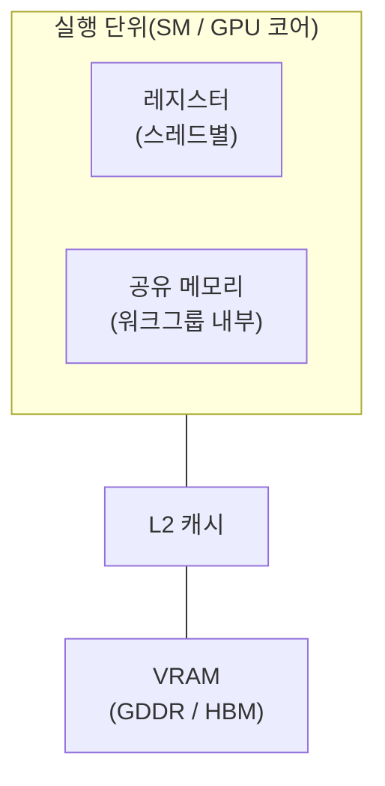

이 장에서 알 수 있는 것:

- GPU 메모리 계층: 레지스터, 공유 메모리, VRAM과 CPU 메모리 계층의 차이
- 메모리 코얼레싱 — 워프 단위 메모리 접근을 효율적으로 묶는 방식
- CPU와 GPU 사이 데이터 전송 비용과 유니파이드 메모리
- 산술 강도와 루프라인 모델 — 처리 성능의 상한을 미리 가늠하는 방법

## GPU의 메모리 계층

GPU에도 메모리 계층이 있지만 CPU와는 성격이 다릅니다.
다음 표와 그림에서 전체 구조를 확인할 수 있습니다.

| 저장 위치 | 공유 범위 | 대략적인 용량 | 특징 |
| --- | --- | --- | --- |
| 레지스터 | 스레드별 | 실행 단위당 수십 KB | 상주하는 모든 스레드의 상태를 물리적으로 보관(9장) |
| 공유 메모리 | 워크그룹 내부 | 실행 단위당 수십~수백 KB | 프로그래머가 명시적으로 사용 |
| L2 캐시 | GPU 전체 | 수MB~수십MB | 하드웨어가 자동 관리 |
| VRAM | GPU 전체 | 수GB~수십GB | 수백 GB/s 이상의 높은 대역폭, 수백 사이클 수준의 지연 시간 |



GPU 전용 메모리인 **VRAM**(video RAM)에는 GDDR이나 HBM처럼
대역폭을 크게 높인 메모리가 사용됩니다. 대역폭은 CPU의 DRAM보다 몇 배에서 수십 배 높아
수백 GB/s에서 수 TB/s에 이를 수 있습니다.
하지만 중요한 점은 **지연 시간이 CPU의 DRAM과 비슷하거나 더 길 수 있다는 것**입니다.
9장에서 본 것처럼 GPU는 메모리 지연을 워프 전환으로 숨기는 구조이므로,
메모리도 낮은 지연 시간보다는 높은 대역폭에 초점을 둡니다.

## 코얼레싱 — 워프 단위의 연속 접근

2장에서는 메모리가 캐시 라인 단위로 이동하기 때문에
연속 접근이 빠르다고 배웠습니다. GPU에도 같은 원칙의 워프 버전이 있습니다.

워프의 여러 스레드는 같은 로드 명령어를 동시에 실행합니다.
이때 각 스레드가 접근하는 주소가 **서로 인접해 있다면** 하드웨어는
여러 접근을 소수의 큰 메모리 전송으로 묶을 수 있습니다.
이를 **메모리 코얼레싱**(memory coalescing)이라고 부릅니다.
반대로 주소가 여기저기 흩어져 있으면 접근을 묶기 어려워지고
필요한 메모리 거래 수가 크게 늘어납니다.

따라서 GPU에서 이상적인 접근 패턴은
"**옆 스레드가 옆 데이터를 읽는 형태**"입니다.
스레드 `i`가 `data[i]`를 읽는 구조는 좋고,
스레드 `i`가 `data[i * stride]`처럼 띄엄띄엄 접근하면 성능이 떨어질 수 있습니다.

2장에서 다룬 SoA(struct of arrays)가 GPU에서 특히 중요한 이유도 여기에 있습니다.
AoS에서는 모든 스레드가 같은 필드 하나를 읽더라도
각 주소가 구조체 전체 크기만큼 떨어져 있을 수 있습니다.
SoA에서는 같은 필드가 연속된 배열에 모여 있기 때문에
메모리 접근을 훨씬 쉽게 코얼레싱할 수 있습니다.
그래서 GPU 데이터 구조에서는 SoA가 기본적인 선택으로 자주 등장합니다.

## 공유 메모리 — 프로그래머가 직접 관리하는 캐시

9장의 표에서 본 **공유 메모리**(shared memory, WGSL에서는 workgroup memory)는
같은 워크그룹에 속한 스레드만 접근할 수 있는 작고 빠른 메모리입니다.
속도는 CPU의 L1 캐시에 가까운 수준이지만 중요한 차이가 있습니다.
CPU 캐시는 하드웨어가 자동으로 관리하지만,
**GPU의 공유 메모리는 프로그래머가 직접 데이터를 옮겨 쓰는 공간**입니다.

11장에서 사용할 WGSL 문법을 미리 보면 `var<workgroup>`으로 선언합니다.
전형적인 사용 방식은
"VRAM에서 작은 타일을 공유 메모리로 가져오기 → 워크그룹 안에서 여러 번 재사용하기 → 다음 타일로 이동하기"입니다.
그룹의 모든 스레드가 같은 시점까지 진행했는지 맞추기 위해 **배리어**(barrier)를 사용합니다.
WGSL에서는 `workgroupBarrier()`를 호출하며,
모든 스레드가 이 지점에 도착할 때까지 기다리는 동기화 지점입니다.
배리어는 모든 스레드가 반드시 지나가는 경로에 있어야 하므로
`if` 한쪽에만 배치해서는 안 됩니다.
실제 예제는 [12장](/gpu/12-cpu-vs-gpu/)의 행렬 곱에서 살펴봅니다.

## CPU와 GPU 사이 — 전송이라는 병목

지금까지는 GPU 내부 메모리를 살펴봤습니다.
하지만 많은 경우 데이터는 처음에 CPU 쪽 메인 메모리에 있습니다.
그래서 **CPU와 GPU 사이의 데이터 전송**이 GPU 활용의 가장 큰 제약 중 하나가 됩니다.

일반적인 PC에서는 독립형 GPU가 PCIe 버스를 통해 CPU와 연결됩니다.
PCIe 4.0 x16의 이론적인 대역폭은 약 32GB/s입니다.
VRAM 내부 대역폭이 수백 GB/s 이상인 것과 비교하면 한 단계 이상 좁은 통로입니다.
데이터를 GPU로 보내고, 계산하고, 결과를 다시 CPU로 가져오는 왕복 비용이
GPU에서 아낀 계산 시간을 넘어서는 경우도 흔합니다.
다음 장의 실험에서는 100만 원소 벡터 덧셈이 CPU보다 약 15배 느리게 나오는 사례도 확인합니다.

반면 Apple Silicon이나 일부 게임 콘솔처럼 CPU와 GPU가
**같은 물리 메모리를 공유하는** 구조도 있습니다.
이를 **유니파이드 메모리**(unified memory)라고 부릅니다.
이 경우 PCIe를 건너는 물리적인 복사를 피할 수 있습니다.
다만 API 수준에서 필요한 버퍼 복사나 동기화가 모두 사라지는 것은 아닙니다.
또한 CPU와 GPU가 같은 메모리 대역폭을 나눠 사용해야 합니다.

어떤 구조든 설계 원칙은 비슷합니다.

- CPU와 GPU 사이의 전송 횟수와 전송량을 최소화합니다
- 한 번 GPU에 올린 데이터에는 여러 처리를 연달아 적용하고, 매 단계마다 CPU로 되돌리지 않습니다
- "계산 부분만 GPU에 넘기면 무조건 빨라진다"고 생각하면 전송 비용을 놓치게 됩니다

## 산술 강도와 루프라인 모델

"이 작업이 GPU에서 빨라질 수 있을까"를 구현 전에 대략 계산하는 방법이 있습니다.

먼저 **FLOP**(floating-point operation)이라는 단위를 사용합니다.
부동소수점 연산 한 번을 1 FLOP이라고 하며,
초당 10억 FLOP은 GFLOP/s, 초당 1조 FLOP은 TFLOP/s라고 표기합니다.

그리고 처리의 **산술 강도**(arithmetic intensity)를
"연산 횟수 ÷ 메모리와 주고받는 바이트 수"인 FLOP/byte로 정의합니다.

- **벡터 덧셈** `c[i] = a[i] + b[i]` — 원소마다 연산 1회,
  읽기 8바이트와 쓰기 4바이트가 필요합니다. 산술 강도는 1/12 ≈ 0.08 FLOP/byte입니다
- **행렬 곱**(n×n) — 출력 n²개 각각에 n번의 곱셈과 덧셈이 필요하므로
  전체 연산량은 약 2n³ FLOP입니다. 데이터는 n² 크기의 행렬 몇 개지만
  같은 데이터를 반복해서 재사용할 수 있기 때문에 이상적인 산술 강도는 n에 비례해 커집니다

이 값을 하드웨어의 "최대 연산 성능"과 "메모리 대역폭"과 함께 그래프로 나타낸 것이
**루프라인 모델**(roofline model)입니다.
다음 그림은 그 개념을 단순화한 것입니다.

<figure class="book-figure">
  <svg viewBox="0 0 640 260" role="img" aria-label="루프라인 모델 그림">
    <style>{`
      .ax { stroke: var(--sl-color-gray-3); stroke-width: 1.5; }
      .roof { stroke: var(--sl-color-accent); stroke-width: 2.5; fill: none; }
      .lbl { fill: var(--sl-color-gray-3); font-size: 12px; }
      .lbl-strong { fill: var(--sl-color-white); font-size: 12px; }
      .pt { fill: var(--sl-color-orange, #e0af68); }
      .guide { stroke: var(--sl-color-gray-5); stroke-dasharray: 4 4; }
    `}</style>
    <line x1="60" y1="220" x2="620" y2="220" class="ax" />
    <line x1="60" y1="220" x2="60" y2="20" class="ax" />
    <text x="240" y="248" class="lbl">산술 강도 (FLOP/byte, 로그 축) →</text>
    <text x="14" y="130" class="lbl" transform="rotate(-90 20 130)">성능 (GFLOP/s, 로그 축) →</text>
    <polyline points="60,200 340,60 620,60" class="roof" />
    <text x="150" y="115" class="lbl-strong" transform="rotate(-26 150 115)">메모리 대역폭 한계</text>
    <text x="430" y="50" class="lbl-strong">최대 연산 성능 한계</text>
    <circle cx="130" cy="165" r="6" class="pt" />
    <line x1="130" y1="165" x2="130" y2="220" class="guide" />
    <text x="90" y="150" class="lbl">벡터 덧셈</text>
    <circle cx="480" cy="60" r="6" class="pt" />
    <line x1="480" y1="60" x2="480" y2="220" class="guide" />
    <text x="440" y="90" class="lbl">큰 행렬 곱</text>
  </svg>
  <figcaption>
    루프라인 모델. 작업의 산술 강도가 도달 가능한 성능 상한을 결정합니다
  </figcaption>
</figure>

그래프의 상한은 두 구간으로 나뉩니다.
산술 강도가 낮은 작업은 왼쪽의 기울어진 구간인
**메모리 대역폭 제한**(memory-bound)에 머뭅니다.
연산 유닛이 아무리 많아도 메모리에서 데이터를 공급하는 속도 이상으로 빨라질 수 없습니다.

반대로 산술 강도가 충분히 높은 작업은 오른쪽의 평평한 구간인
**연산 성능 제한**(compute-bound)에 접근할 수 있습니다.
이 영역에서는 GPU의 연산 유닛 자체를 얼마나 잘 활용하는지가 중요합니다.

벡터 덧셈처럼 산술 강도가 0.1 FLOP/byte 이하인 작업은
GPU로 옮겨도 결국 메모리 대역폭에 막히기 쉽습니다.
반면 행렬 곱처럼 같은 데이터를 여러 번 재사용해
산술 강도를 크게 만들 수 있는 작업은 GPU의 강점을 살리기 좋습니다.
그리고 12장에서는 **같은 행렬 곱이라도 커널을 어떻게 작성하느냐에 따라
연산과 메모리 접근의 비율이 달라지고 성능도 크게 달라지는 것**을 실제로 측정합니다.

## 직접 확인하기: 산술 강도의 차이 보기

저장소를 로컬에 내려받았다면 12장의 행렬 곱 예제로
이 장의 개념을 미리 확인할 수 있습니다.

```sh
cd examples
cargo run --release -p ch12-matmul -- 512
```

출력되는 GFLOP/s 값을 단순한 CPU 버전부터 GPU 버전까지 비교해 보세요.
같은 2n³번의 연산을 하더라도 메모리를 사용하는 방식에 따라
실제 성능이 두 자릿수 배율로 달라질 수 있습니다.
결과를 해석하는 방법은 12장에서 자세히 설명합니다.

## 정리

- GPU 메모리는 높은 대역폭을 우선하도록 설계됩니다. 긴 지연 시간은 워프 전환으로 숨깁니다
- 같은 워프의 인접한 스레드가 인접한 주소를 읽으면 메모리 접근을 묶을 수 있습니다.
  이를 코얼레싱이라고 하며, SoA가 GPU에서 중요한 이유이기도 합니다
- 공유 메모리는 프로그래머가 직접 관리하는 작은 캐시와 비슷합니다.
  워크그룹 배리어로 동기화하면서 사용합니다
- CPU-GPU 사이 전송은 PCIe 같은 상대적으로 좁은 통로를 거칠 수 있으므로
  전송 횟수를 줄이는 것이 중요합니다. 유니파이드 메모리는 물리적 복사를 줄이지만 메모리 대역폭은 공유합니다
- 산술 강도와 루프라인 모델을 이용하면 특정 작업이 메모리 제한인지 연산 제한인지,
  어느 정도까지 빨라질 수 있는지 구현 전에 대략 가늠할 수 있습니다

개념 준비는 끝났습니다. 다음 장에서는 Rust에서 wgpu를 사용해
실제로 GPU에서 코드를 실행해 보겠습니다.