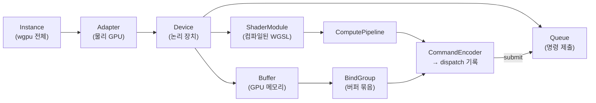

이 장에서 알 수 있는 것:

- Rust에서 GPU를 사용하는 주요 선택지: wgpu, CUDA, rust-gpu 등
- WebGPU의 주요 구성 요소: Device, Queue, 버퍼, 바인드 그룹, 파이프라인
- WGSL로 컴퓨트 셰이더를 작성하는 방법
- 벡터 덧셈을 처음부터 끝까지 실행하는 코드와 실제 측정 결과
- "GPU에 넘기면 무조건 빨라진다"는 생각이 왜 틀릴 수 있는지

이 장의 전체 코드는 저장소의 `examples/ch11-vector-add`에 있습니다.
GPU는 브라우저의 Rust Playground에서 사용할 수 없으므로,
이 장과 다음 장의 실험은 로컬 환경에서 실행해야 합니다.

```sh
cd examples
cargo run --release -p ch11-vector-add
```

## Rust에서 GPU를 사용하는 방법

2026년 기준으로 대표적인 선택지는 다음과 같습니다.

- **wgpu** — 브라우저 표준 GPU API인 **WebGPU**
  ([W3C 사양](https://www.w3.org/TR/webgpu/))의 Rust 구현입니다.
  실행 환경에 따라 Metal(macOS), Vulkan(Linux/Android), DirectX 12(Windows)로
  연결해 줍니다. 특정 GPU 제조사에 종속되지 않는 범용 GPU 계산에 적합하며,
  이 책에서는 wgpu를 사용합니다
- **CUDA 계열**(`cudarc` 크레이트 등) — NVIDIA GPU 전용입니다.
  성능 상한과 cuBLAS 같은 라이브러리 생태계가 매우 강력하지만
  하드웨어와 도구 체인이 NVIDIA에 종속됩니다
- **rust-gpu** — 셰이더 자체를 Rust로 작성해 SPIR-V로 컴파일하는 프로젝트입니다.
  "셰이더 언어도 Rust로 작성한다"는 방향이지만,
  이 책에서는 표준 셰이더 언어인 WGSL을 사용합니다
- **burn / candle** — 머신러닝 프레임워크입니다. 내부적으로 wgpu나 CUDA를 사용합니다.
  목적이 단순히 행렬 연산이라면 직접 셰이더를 작성하기보다
  이런 검증된 라이브러리를 사용하는 편이 보통 더 빠르고 안전합니다

## WebGPU의 구성 요소

wgpu API는 그래픽스 API 계열이라 처음 보면 구성 요소가 많게 느껴질 수 있습니다.
먼저 관계를 그림으로 정리해 보겠습니다.



- **Instance** → **Adapter** → **Device** 순서로 GPU 연결을 설정합니다.
  Device가 리소스를 만들고, **Queue**가 작업을 GPU에 제출합니다
- **Buffer**는 GPU 측 메모리이고, **BindGroup**은 셰이더의 각 binding 번호에
  어떤 버퍼를 연결할지 정하는 대응표입니다
- **ComputePipeline**은 "이 셰이더의 이 함수를 실행한다"는 실행 상태이고,
  **CommandEncoder**는 GPU에 보낼 명령을 기록하는 객체입니다

## WGSL로 셰이더 작성하기

GPU에서 실행하는 프로그램을 **셰이더**(shader)라고 부릅니다.
WebGPU에서는 **WGSL**(WebGPU Shading Language)이라는 전용 언어로 작성합니다.
다음은 벡터 덧셈 셰이더 전체입니다.

```wgsl
// add.wgsl — c[i] = a[i] + b[i]

@group(0) @binding(0)
var<storage, read> a: array<f32>;

@group(0) @binding(1)
var<storage, read> b: array<f32>;

@group(0) @binding(2)
var<storage, read_write> c: array<f32>;

@compute @workgroup_size(64)
fn add(@builtin(global_invocation_id) gid: vec3<u32>) {
    let i = gid.x;
    // 원소 수가 64의 배수가 아니면 범위를 벗어난 스레드는 아무 작업도 하지 않습니다
    if (i >= arrayLength(&a)) {
        return;
    }
    c[i] = a[i] + b[i];
}
```

읽을 때 중요한 점은 세 가지입니다.

- `var<storage, ...>`는 VRAM에 있는 버퍼입니다. `@group`과 `@binding` 번호로
  Rust 쪽 바인드 그룹과 연결합니다
- `add` 함수는 **원소 하나마다 한 번씩** 병렬로 호출됩니다.
  자신이 몇 번째 호출인지 `global_invocation_id`로 알 수 있습니다.
  셰이더에서는 "루프 전체"가 아니라 "루프 본문 하나"를 작성한다고 생각하면 됩니다
- `@workgroup_size(64)`는 64개 스레드를 하나의 워크그룹(9장)으로 묶는다는 뜻입니다.
  실행할 때 워크그룹 개수를 지정하므로 전체 스레드 수는 64 × 그룹 수가 됩니다

9장의 SIMT를 떠올려 보세요. 이렇게 원소 하나를 처리하는 스칼라 코드가
실제 하드웨어에서는 워프 단위의 벡터 실행으로 처리됩니다.
또한 인접한 스레드 `i`와 `i+1`이 인접한 데이터를 읽기 때문에
메모리 접근도 자연스럽게 코얼레싱됩니다(10장).

## Rust 쪽 코드 — 연결부터 결과 읽기까지

Rust 쪽 코드는 길기 때문에 핵심 단계만 발췌합니다.
전체 코드는 `examples/ch11-vector-add/src/main.rs`에 있습니다.

**1. GPU에 연결합니다.** wgpu의 비동기 API는 계산 프로그램에서는
`pollster`로 동기적으로 기다리는 방식으로 간단히 사용할 수 있습니다.

```rust
let instance = wgpu::Instance::new(wgpu::InstanceDescriptor::new_without_display_handle());
let adapter = pollster::block_on(instance.request_adapter(&Default::default()))
    .expect("GPU를 찾을 수 없습니다");
let (device, queue) = pollster::block_on(adapter.request_device(&wgpu::DeviceDescriptor {
    // 기본값으로 충분한 항목은 생략합니다. 전체 코드는 저장소를 참고하세요
    ..
}))?;
```

**2. 셰이더를 컴파일하고 버퍼를 만듭니다.** 입력 데이터는
`bytemuck` 크레이트로 `&[f32]`를 바이트 배열로 바꿔 기록합니다.
버퍼 용도는 `usage` 플래그로 선언합니다.

```rust
let module = device.create_shader_module(wgpu::include_wgsl!("add.wgsl"));

let buf_a = device.create_buffer_init(&wgpu::util::BufferInitDescriptor {
    label: Some("a"),
    contents: bytemuck::cast_slice(&a),
    usage: wgpu::BufferUsages::STORAGE,
});
// b도 같은 방식으로 만듭니다. 출력 c는 STORAGE | COPY_SRC,
// CPU로 읽어올 buf_read는 COPY_DST | MAP_READ로 만듭니다
```

CPU가 직접 읽을 수 있는 버퍼(`MAP_READ`)와 셰이더가 읽고 쓰는 버퍼(`STORAGE`)가
서로 구분되어 있다는 점에 주목하세요.
10장에서 살펴본 "CPU와 GPU 사이의 전송은 병목이 될 수 있다"는 사실이
API 구조에도 그대로 드러납니다.

**3. 바인드 그룹과 파이프라인을 만듭니다.**
셰이더의 `@binding` 번호와 실제 버퍼를 연결하고,
엔트리 포인트 `add`를 지정해 컴퓨트 파이프라인을 만듭니다.

```rust
// 레이아웃 = "binding 0,1은 읽기 전용, 2는 쓰기 가능"이라는 타입 선언
// 정형 코드가 길기 때문에 전체 형태는 저장소를 참고하세요
let bgl = device.create_bind_group_layout(/* 각 binding 타입 선언 */);

// 바인드 그룹 = 레이아웃에 실제 버퍼를 연결한 값
let bind_group = device.create_bind_group(&wgpu::BindGroupDescriptor {
    layout: &bgl,
    entries: &[
        wgpu::BindGroupEntry { binding: 0, resource: buf_a.as_entire_binding() },
        wgpu::BindGroupEntry { binding: 1, resource: buf_b.as_entire_binding() },
        wgpu::BindGroupEntry { binding: 2, resource: buf_c.as_entire_binding() },
    ],
    label: None,
});

// 파이프라인 = 셰이더 모듈 + 레이아웃 + 엔트리 포인트
let pipeline = device.create_compute_pipeline(&wgpu::ComputePipelineDescriptor {
    module: &module,
    entry_point: Some("add"),
    /* layout 등은 전체 코드를 참고하세요 */
    ..
});
```

이제 다음 단계에서 사용할 `bind_group`과 `pipeline`이 준비되었습니다.

**4. 명령을 기록하고 제출합니다.** 100만 개의 원소를 워크그룹 크기 64로 나눈 만큼
워크그룹을 실행합니다.

```rust
let mut encoder = device.create_command_encoder(&Default::default());
{
    let mut pass = encoder.begin_compute_pass(&Default::default());
    pass.set_pipeline(&pipeline);
    pass.set_bind_group(0, &bind_group, &[]);
    pass.dispatch_workgroups(n.div_ceil(64) as u32, 1, 1); // 15625개 그룹
}
encoder.copy_buffer_to_buffer(&buf_c, 0, &buf_read, 0, buf_c.size());
queue.submit([encoder.finish()]);
```

`submit`하기 전까지 GPU에서는 실제 작업이 시작되지 않습니다.
기록한 명령 묶음인 계산과 결과 복사가 한꺼번에 제출되고 비동기로 실행됩니다.

**5. 결과를 읽습니다.** 읽기용 버퍼를 CPU가 볼 수 있도록 매핑하고,
GPU 작업이 끝날 때까지 기다린 뒤 바이트 배열을 `Vec<f32>`로 변환합니다.

```rust
let slice = buf_read.slice(..);
slice.map_async(wgpu::MapMode::Read, |_| {});
device.poll(wgpu::PollType::wait_indefinitely())?;
let data = slice.get_mapped_range()?;
let c: Vec<f32> = bytemuck::allocation::pod_collect_to_vec(&data);
```

덧셈 한 번을 실행하려고 100줄이 넘는 준비 코드가 필요하다는 점은 분명 번거롭습니다.
하지만 어떤 계산에서도 이 구조는 거의 비슷하기 때문에 실무에서는
한 번 헬퍼로 감싸 두고 재사용합니다.
"버퍼 만들기 → 연결하기 → 명령 기록 → 제출 → 결과 읽기"라는 뼈대만 기억하면 됩니다.

## 실행 결과 — CPU보다 느립니다

저자의 Mac(Apple M4)에서 실행한 결과입니다.

```text
GPU: Apple M4
GPU 실행+읽기: 6.757292ms
CPU(1코어)   : 434.166µs
검증: OK (c[10] = 30)
```

GPU가 CPU 한 코어보다 **약 15배 느렸습니다**.

앞 장의 내용으로 이 결과를 설명할 수 있습니다.
벡터 덧셈의 산술 강도는 약 0.08 FLOP/byte로 매우 낮아 완전히 메모리 대역폭에 제한되는 작업입니다.
GPU에 수천 개의 연산 유닛이 있어도 대부분 활용할 일이 없습니다.
여기에 "GPU 실행+읽기" 시간에는 명령 기록과 제출, 완료 대기,
버퍼 매핑 같은 API 왕복 비용까지 포함됩니다.
이 비용은 밀리초 수준이라 실제 커널 계산 시간인 마이크로초 수준을 쉽게 덮어 버립니다.
유니파이드 메모리를 사용하는 M4에서도 이 정도이며,
PCIe로 연결된 외장 GPU에서는 데이터 전송 비용이 추가로 발생합니다.

이것이 "GPU에 넘기기만 하면 빨라진다"는 생각이 틀린 이유입니다.
GPU가 이기려면 전송과 실행 오버헤드를 감수하고도 남을 만큼
높은 산술 강도와 충분히 큰 문제 규모가 필요합니다.
다음 장에서 그 손익분기점을 직접 측정합니다.

:::note[이 코드가 브라우저에서 실행되지 않는 이유와 브라우저에서 실행하는 방법]
이 책의 대화형 코드는 Rust Playground 서버에서 실행되기 때문에 GPU를 사용할 수 없습니다.
반면 wgpu 자체는 WebAssembly로 컴파일해 브라우저의 **WebGPU** API에서 실행할 수 있습니다.
"같은 Rust 코드가 네이티브와 브라우저 양쪽에서 실행된다"는 것이 WebGPU의 큰 장점입니다.
웹 애플리케이션 개발자에게는 오히려 이 사용 방식이 더 중요한 경우도 있습니다.
:::

## 정리

- Rust에서 범용 GPU 계산을 할 때 wgpu는 대표적인 선택지입니다.
  Metal/Vulkan/DX12 차이를 흡수하고 셰이더는 WGSL로 작성합니다
- 셰이더는 "루프의 본문만 작성하는" 형태입니다. 원소 하나당 스레드 하나가 실행되고,
  인접 스레드의 인접 메모리 접근은 코얼레싱됩니다
- Rust 쪽 코드는 버퍼 생성 → 바인딩 → 파이프라인 → 명령 기록 → 제출 → 결과 읽기라는 흐름을 가집니다
- 100만 원소 벡터 덧셈은 CPU보다 약 15배 느렸습니다.
  산술 강도가 낮고 규모가 작은 작업은 GPU에 적합하지 않을 수 있습니다

다음 장에서는 산술 강도가 높은 행렬 곱을 CPU와 GPU에서 단계별로 최적화하면서
어떤 상황에서 어느 쪽을 선택할지 기준을 세웁니다.