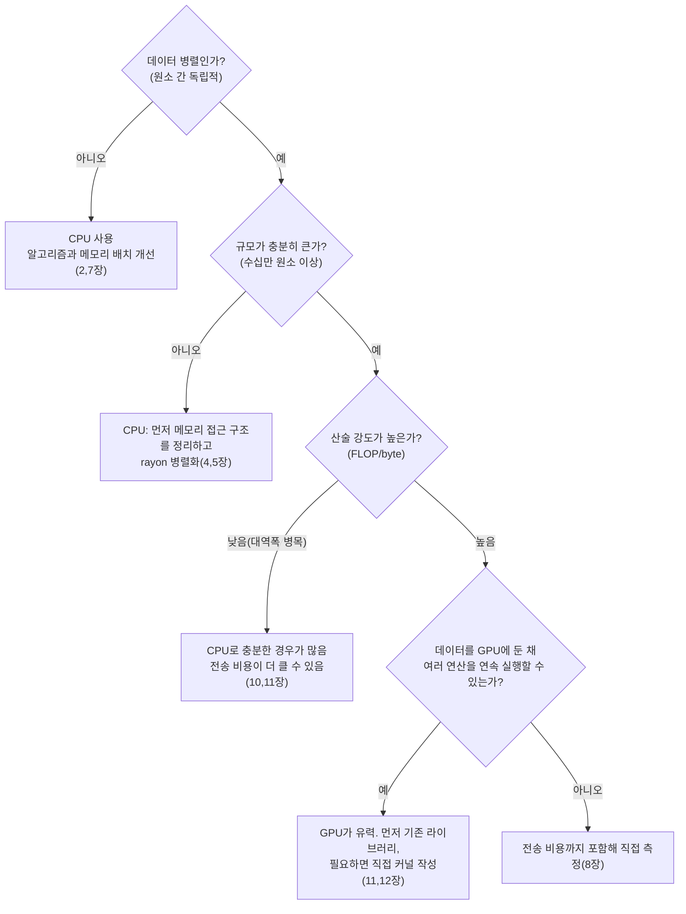

이 장에서 알 수 있는 것:

- 같은 행렬 곱이 코드 작성 방식만으로 77배 차이 나는 과정과 실제 측정값
- CPU 쪽 최적화: 루프 순서 변경과 병렬화
- GPU 쪽 최적화: 단순 커널에서 산술 강도를 높이는 방법
- CPU와 GPU 중 어느 쪽을 선택할지 판단하는 기준

이 장의 모든 실험은 저장소의 `examples/ch12-matmul`에서 재현할 수 있습니다.

```sh
cd examples
cargo run --release -p ch12-matmul        # n=1024
cargo run --release -p ch12-matmul -- 2048
```

측정 환경은 저자의 Mac(Apple M4, CPU 10코어, GPU 10코어, 유니파이드 메모리)입니다.
배율은 하드웨어에 따라 달라지지만 어떤 변화가 왜 효과를 내는지는 공통적입니다.

## 예제 — 행렬 곱

n×n 행렬의 곱 C = A × B를 `f32`로 계산합니다.
정의 그대로 작성하면 다음과 같습니다.

```rust
/// 단순한 3중 루프(ijk 순서)
fn matmul_naive(a: &[f32], b: &[f32], c: &mut [f32], n: usize) {
    for i in 0..n {
        for j in 0..n {
            let mut sum = 0.0;
            for k in 0..n {
                sum += a[i * n + k] * b[k * n + j];
            }
            c[i * n + j] = sum;
        }
    }
}
```

연산량은 2n³입니다. n=1024라면 약 21억 번의 부동소수점 연산이 필요합니다.
데이터는 행렬 세 장을 합쳐 약 12MB입니다.
데이터량보다 연산량이 압도적으로 많은, 산술 강도가 높은 문제입니다(10장).
그래서 행렬 곱은 머신러닝의 핵심 연산이면서 고전적인 최적화 예제이기도 합니다.

n=1024에서 측정한 단순 버전의 결과는 **873밀리초(2.5 GFLOP/s)**였습니다.
여기에서 시작합니다.

## CPU 1단계 — 루프 순서만 바꿔도 13배

단순 버전의 가장 큰 문제는 가장 안쪽 루프의 `b[k * n + j]`입니다.
`k`가 증가할 때마다 주소가 n×4바이트, 즉 4KB씩 이동합니다.
2장에서 본 좋지 않은 접근 패턴입니다.
매번 다른 캐시 라인에 접근하고 하드웨어 프리페치도 잘 활용하기 어렵습니다.

루프의 중첩 순서를 ijk에서 **ikj**로 바꿔 보겠습니다.

```rust
/// 루프 순서를 ikj로 변경합니다. 가장 안쪽 접근이 모두 행 방향으로 연속됩니다
fn matmul_ikj(a: &[f32], b: &[f32], c: &mut [f32], n: usize) {
    c.fill(0.0);
    for i in 0..n {
        for k in 0..n {
            let aik = a[i * n + k];
            let b_row = &b[k * n..k * n + n];
            let c_row = &mut c[i * n..i * n + n];
            for j in 0..n {
                c_row[j] += aik * b_row[j];
            }
        }
    }
}
```

계산 내용과 연산 횟수는 완전히 같습니다.
하지만 가장 안쪽 루프는 이제 "연속된 `b` 행을 읽고 연속된 `c` 행에 더한다"는 형태가 됩니다.
캐시 라인의 모든 바이트를 활용할 수 있고(2장),
서로 독립적인 연속 접근이므로 자동 벡터화도 적용하기 쉬워집니다(4장).

측정 결과는 **67밀리초(32 GFLOP/s)**였습니다. 약 13배 빨라졌습니다.
알고리즘은 그대로 두고 메모리 접근 순서만 바꾼 결과입니다.
이 책에서 특히 강조하고 싶은 사례입니다.

## CPU 2단계 — 병렬화로 추가 4.4배

ikj 버전에서는 각 행의 계산이 서로 독립적이므로 rayon(5장)으로
행 단위 병렬화를 적용할 수 있습니다.
`c.par_chunks_mut(n)`으로 `c`를 행 단위로 나누고 각 스레드가 자신의 행만 수정합니다.
Rust는 데이터 레이스가 없는 구조인지 컴파일 시점에 검사해 줍니다.

측정 결과는 **16.2밀리초(132 GFLOP/s)**였습니다.
10코어 환경에서 약 4배 빨라졌습니다.
코어 수와 같은 10배가 나오지 않는 이유는 메모리 대역폭을 공유한다는 점과
Apple Silicon의 CPU가 고성능 P 코어와 고효율 E 코어가 섞인 구조라는 점 때문입니다.
5장에서 살펴본 병렬 확장의 한계가 그대로 나타납니다.

처음 단순 버전과 비교하면 약 54배입니다.
CPU 쪽 최적화는 여기까지 진행합니다.
캐시 블로킹이나 명시적인 SIMD를 더 적용할 수도 있습니다.

## GPU 1단계 — 단순한 커널

같은 계산을 GPU로 옮겨 보겠습니다.
스레드 하나가 C의 원소 하나를 담당하는 가장 단순한 WGSL 커널입니다.
전체 구조는 11장에서 본 벡터 덧셈과 같습니다.

```wgsl
@compute @workgroup_size(16, 16)
fn matmul_naive(@builtin(global_invocation_id) gid: vec3<u32>) {
    let n = params.n;
    let row = gid.y;
    let col = gid.x;
    if (row >= n || col >= n) { return; }
    var sum = 0.0;
    for (var k = 0u; k < n; k = k + 1u) {
        sum = sum + a[row * n + k] * b[k * n + col];
    }
    c[row * n + col] = sum;
}
```

약 100만 개의 스레드를 실행합니다.
계산 시간만 측정한 결과는 **14.4밀리초(149 GFLOP/s)**였습니다.
처음부터 CPU 10코어 병렬 버전과 비슷한 수준입니다.
9장에서 설명한 대규모 병렬성의 효과가 실제로 나타납니다.

## GPU 2단계 — 공유 메모리 타일링과 예상 밖의 결과

GPU 최적화의 대표적인 방법은 10장에서 설명한 공유 메모리를 활용하는 것입니다.
16×16 워크그룹이 A와 B의 작은 타일을 공유 메모리에 적재하고,
배리어로 동기화하면서 같은 데이터를 여러 번 재사용합니다.

```wgsl
var<workgroup> tile_a: array<f32, 256>;
var<workgroup> tile_b: array<f32, 256>;
// 각 스레드가 타일의 원소 하나를 옮깁니다 → workgroupBarrier() →
// 타일의 16개 원소에 대한 곱셈과 덧셈을 공유 메모리에서 수행합니다 → 다음 타일로 이동합니다
```

측정 결과는 **15.9밀리초(135 GFLOP/s)**였습니다. 오히려 빨라지지 않았습니다.

교과서적인 최적화가 실제 하드웨어에서는 효과가 없을 수도 있습니다.
가능한 이유는 이 하드웨어와 커널의 조합에 있습니다.
M4는 유니파이드 메모리와 비교적 큰 캐시를 사용합니다.
단순 커널에서도 `b`의 읽기는 코얼레싱되고 `a`의 행은 캐시에서 재사용되기 때문에
메모리 전송이 이미 큰 병목이 아닐 가능성이 있습니다.

그렇다면 실제 병목은 메모리 대역폭이 아니라
**곱셈과 덧셈 한 번을 위해 두 번의 로드 명령을 실행해야 하는 명령 구성**일 수 있습니다.
커널 내부의 하드웨어 카운터를 측정한 것은 아니므로 이 설명은 가설입니다.
하지만 다음 실험이 이 가설과 잘 맞습니다.

어쨌든 병목이 아닌 부분을 개선해도 성능은 좋아지지 않는다는 8장의 교훈은 GPU에서도 같습니다.
캐시가 더 작은 외장 GPU에서는 같은 타일링이 큰 효과를 내는 경우가 흔합니다.
최적화 결과는 하드웨어에 따라 달라집니다.

## GPU 3단계 — 스레드 하나가 더 많은 연산을 수행하게 하기

병목이 "로드 명령 수에 비해 연산량이 적다"는 데 있다면
스레드 하나가 더 많은 계산을 맡게 만들 수 있습니다.
스레드 하나가 C의 **4×4 블록**을 계산하도록 바꿉니다.

```wgsl
@compute @workgroup_size(8, 8)
fn matmul_blocked(@builtin(global_invocation_id) gid: vec3<u32>) {
    // 4×4개의 누적 값을 레지스터에 보관합니다
    var acc: array<vec4<f32>, 4>;
    for (var k = 0u; k < n; k = k + 1u) {
        let vb = /* b 행에서 4개 원소 */;      // 4번 로드
        for (var i = 0u; i < 4u; i = i + 1u) {
            let aik = a[(row0 + i) * n + k];  // 4번 로드
            acc[i] = acc[i] + aik * vb;       // 16번 곱셈+덧셈
        }
    }
    // acc를 c에 기록합니다
}
```

반복 한 번에 메모리 읽기 8번으로 곱셈과 덧셈을 16개 수행합니다.
단순 버전의 "메모리 참조 2번에 곱셈과 덧셈 1번"과 비교하면
연산 대비 로드 비율이 네 배 높아집니다.

측정 결과는 **11.3밀리초(190 GFLOP/s)**였습니다.
이번에는 실제로 빨라졌습니다.
10장의 루프라인 모델처럼 어떤 자원이 병목인지 먼저 판단한 뒤
그 자원에 맞는 최적화를 적용해야 한다는 원칙이 GPU 커널에서도 그대로 적용됩니다.

실제 라이브러리 수준의 행렬 곱 커널은 타일링, 블로킹, 벡터 로드를 여러 단계로 결합해
이 GPU에서도 수 TFLOP/s 수준까지 성능을 끌어올립니다.
직접 작성한 커널은 그 출발점 정도입니다.
단지 행렬 곱이 목적이라면 Metal Performance Shaders나 cuBLAS 같은
검증된 라이브러리를 사용하는 것이 더 좋은 선택입니다.

## 결과 정리

n=1024에서 계산 시간만 비교한 결과입니다.

| 구현 | 시간 | GFLOP/s | 단순 버전 대비 |
| --- | --- | --- | --- |
| CPU 단순(ijk) | 873 ms | 2.5 | 1x |
| CPU ikj | 67 ms | 32 | 13x |
| CPU ikj + rayon(10코어) | 16.2 ms | 132 | 54x |
| GPU 단순 | 14.4 ms | 149 | 61x |
| GPU 타일링 | 15.9 ms | 135 | 55x |
| GPU 블로킹 | 11.3 ms | 190 | **77x** |

n=2048에서도 전체적인 관계는 비슷합니다.
CPU 병렬 버전은 117밀리초, GPU 블로킹 버전은 89밀리초였습니다.
중요한 주의점이 세 가지 있습니다.

- GPU 시간에 **초기화와 전송까지 포함하면** n=1024 블로킹 버전은 약 15밀리초가 되고
  CPU 병렬 버전과 거의 비슷해집니다. 한 번만 실행하는 계산이라면 GPU의 우위가 사라질 수 있습니다
- 이 결과는 유니파이드 메모리를 사용하는 Mac에서 얻었습니다.
  강력한 외장 GPU라면 계산 성능은 더 높을 수 있지만 PCIe 전송 비용도 커집니다.
  **하드웨어 구성에 따라 결과는 달라집니다**
- 측정 조건도 완전히 대칭적이지 않습니다. GPU 시간은 디스패치와 완료 대기를 포함한 벽시계 시간이라
  커널 자체 시간보다 길게 측정되며, CPU 쪽은 각 버전을 한 번씩 측정했습니다.
  엄밀한 비교라면 GPU 타임스탬프와 여러 번 반복한 통계가 필요합니다(8장).
  여기에서는 성능 경향을 이해하는 것이 목적입니다

## CPU와 GPU 선택 기준

지금까지의 내용을 하나의 흐름으로 정리하면 다음과 같습니다.



어느 경로를 선택해도 변하지 않는 원칙이 세 가지 있습니다.

1. **GPU는 최적화된 CPU 코드와 비교해야 합니다.** 단순 CPU 코드와 비교하면 GPU가 77배 빨라 보였지만,
   최적화된 CPU 병렬 코드와 비교하면 약 1.4배 차이였습니다.
   "GPU로 100배 빨라졌다"는 결과를 볼 때는 CPU 쪽 코드가 기본적인 메모리 접근 최적화조차 하지 않은 것은 아닌지 확인해야 합니다
2. **성능의 근본 원리는 CPU와 GPU가 같습니다.** 연속적인 메모리 접근,
   높은 병렬성, 정렬된 분기 패턴, 높은 산술 강도가 중요합니다.
   CPU에서 배운 원리는 GPU에서도 적용되고 그 반대도 마찬가지입니다
3. **마지막 결정은 측정으로 내려야 합니다.** 이 장의 "타일링이 효과가 없었던" 사례처럼
   예상 밖의 결과는 실제 측정으로만 발견할 수 있습니다

## 정리

이 장의 결론은 이 책의 기초편 전체 결론이기도 합니다.
12개 장의 내용을 세 줄로 줄이면 다음과 같습니다.

- 현대 컴퓨팅의 성능은 연산 자체보다 **메모리 접근 방식과 병렬성**에 크게 좌우됩니다
- Rust는 제로 비용 추상화와 안전한 병렬성을 통해 두 요소를 높은 수준에서 함께 다룰 수 있는 언어입니다
- 직감은 자주 틀립니다. **어셈블리와 측정**을 통해 실제로 무슨 일이 벌어지는지 확인해야 합니다

기초편은 여기까지입니다.
여기까지 읽었다면 이제 "왜 이 코드가 빠른가"를 하드웨어와 컴파일러 구조를 이용해 설명할 수 있을 것입니다.
용어를 다시 확인하고 싶다면 [용어집](/appendix/glossary/)을 참고하세요.

이후에는 응용편 Part IV~VII가 이어집니다.
수의 표현, 가상 메모리, 캐시 내부 구조, 할당자, async, GPU 커널 기법처럼
기초편에서 의도적으로 생략했던 중요한 주제를 같은 방식으로 다룹니다.
실제 측정과 동작 원리를 중심으로 하나씩 살펴봅니다.
다음은 [13장 수의 표현](/cpu-deep/13-numbers/)입니다.