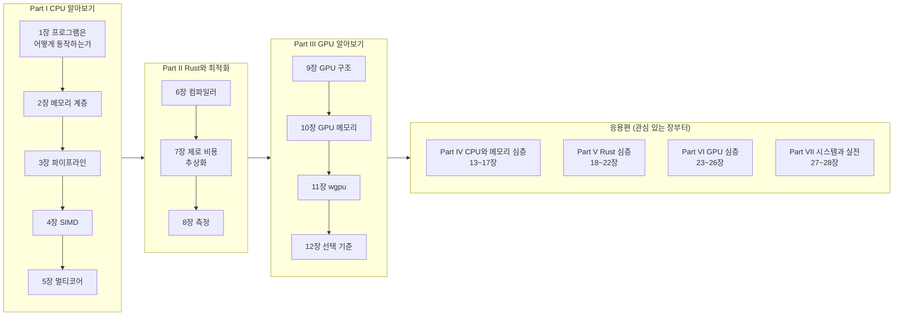

import RustPlay from '@components/RustPlay.astro';
import hello from '@snippets/intro/hello.rs?raw';

이 책은 **웹 애플리케이션 개발자를 위한 CPU와 GPU 교과서**입니다.
Rust 코드를 출발점으로 삼아, 컴퓨터가 실제로 어떻게 계산하는지를
하드웨어의 동작 수준까지 내려가 이해하는 것을 목표로 합니다.

## 대상 독자

다음과 같은 독자를 대상으로 합니다.

- 웹 애플리케이션 개발 경험은 있지만 CPU나 GPU 내부 구조에는 익숙하지 않은 사람
- Rust의 주요 개념(소유권, 트레이트, 제네릭 등)은 알고 있지만,
  컴파일러 내부에서 무슨 일이 일어나는지는 잘 모르는 사람
- "왜 이 코드는 빠른가/느린가"를 감이 아니라 원리로 설명할 수 있게 되고 싶은 사람

Rust 문법 자체는 설명하지 않습니다. 반대로 CPU와 GPU는 사전 지식이 전혀 없는 상태부터
설명합니다. 전문 용어는 처음 등장할 때 반드시 설명하며, 책 뒤의 [용어집](/appendix/glossary/)에도 정리해 두었습니다.

## 이 책에서 무엇을 알 수 있나

책을 다 읽고 나면 다음 질문에 자신의 말로 답할 수 있게 됩니다.

- CPU는 프로그램을 어떻게 실행하는가. 캐시와 파이프라인은 무엇인가
- 배열 순회는 왜 빠르고 연결 리스트 순회는 왜 느린가
- Rust 컴파일러는 작성한 코드를 어떤 기계어로 바꾸고, 어떻게 최적화하는가
- "제로 비용 추상화"는 어디까지 사실인가. 이터레이터는 정말 루프와 같은 속도인가
- GPU는 왜 특정 계산에서만 압도적으로 빠른가. CPU와는 어떻게 구분해서 써야 하는가
- Rust에서 GPU를 사용하려면 어떻게 해야 하는가

## 구성

다음 그림은 이 책의 전체 흐름입니다. 기초편의 세 Part를 순서대로 따라간 뒤,
그 이후의 응용편(Part IV~VII)은 관심 있는 장부터 읽을 수 있습니다.

이 책은 **기초편**(Part I~III)과 **응용편**(Part IV~VII)의 두 부분으로 구성됩니다.

기초편은 사전 지식이 없는 상태에서 최단 경로로 "원리를 바탕으로 성능을 설명할 수 있는" 수준에
도달하는 것을 목표로 합니다.

- **Part I(CPU 알아보기)** — 기계어와 레지스터에서 시작해 메모리 계층, 파이프라인,
  SIMD, 멀티코어까지 현대 CPU의 주요 원리를 하나씩 살펴봅니다
- **Part II(Rust와 최적화)** — Part I에서 배운 내용을 바탕으로 Rust 컴파일러가 코드를
  어떻게 기계어로 변환하고 최적화하는지 확인하는 방법을 배웁니다
- **Part III(GPU 알아보기)** — CPU와 비교하며 GPU의 설계를 이해하고,
  wgpu를 사용해 실제로 Rust에서 GPU 계산을 실행합니다

응용편에서는 기초편에서 의도적으로 생략했던, "전체 체계를 완성하기 위한 핵심 주제"를 다룹니다.
각 장은 독립적으로 읽을 수 있지만 모두 기초편의 내용을 이해하고 있다는 전제에서 출발합니다.

- **Part IV(CPU와 메모리 심층)** — 수의 표현, 가상 메모리와 TLB,
  캐시 내부 구조, CPU 프런트엔드, 메모리 모델의 구현
- **Part V(Rust 심층)** — 할당자, async의 실제 구조, unsafe와 UB,
  빌드 제어, 자료구조의 실제 성능
- **Part VI(GPU 심층)** — 커널 최적화 체계, 전송 지연 숨기기,
  행렬 엔진과 혼합 정밀도, GPU 성능 측정
- **Part VII(시스템과 실전)** — OS 계층의 비용, 실무 성능 엔지니어링,
  그리고 전체 지식 지도

기초편의 각 장은 앞 장의 내용을 전제로 하므로 순서대로 읽는 것을
권합니다. 응용편은 관심 있는 장부터 읽어도 괜찮습니다.

## 코드를 바로 실행할 수 있습니다

본문의 코드 블록 대부분은 **브라우저에서 그대로 실행할 수 있습니다**.
"▶ 실행"을 누르면 코드가 Rust 공식 실행 환경인 [Rust Playground](https://play.rust-lang.org/)로
전송되고, 컴파일과 실행 결과가 표시됩니다.
"편집"을 누르면 코드를 바꿔 직접 시험할 수도 있습니다.

<RustPlay code={hello} />

GPU를 사용하는 장의 코드는 브라우저에서 실행할 수 없으므로, 로컬에서 실행할 수 있는
완전한 프로젝트를 저장소의 `examples/` 디렉터리에 준비해 두었습니다.

## 표기와 환경

- 설명을 위해 제시하는 수치(캐시 용량, 지연 시간 등)는 별도 언급이 없다면
  현대의 일반적인 CPU·GPU에서 볼 수 있는 대략적인 값입니다. 실제 값은 하드웨어마다 다릅니다
- "저자 실측"이라고 표시된 값은 별도 언급이 없다면 Rust Playground
  (공유 x86-64 Linux 환경, stable rustc, release 빌드)에서 측정한 값입니다.
  "로컬 Mac"이라고 표시된 값은 Apple M4(CPU 10코어, GPU 10코어,
  통합 메모리)에서 측정한 값입니다. 공유 환경의 값은 실행할 때마다 달라질 수 있습니다
- 명령어 실행 예시는 macOS / Linux 셸을 기준으로 합니다
- Rust 코드는 에디션 2024를 기준으로 합니다

그럼 [1장 프로그램은 어떻게 동작하는가](/cpu/01-how-code-runs/)부터 시작해 봅시다.
