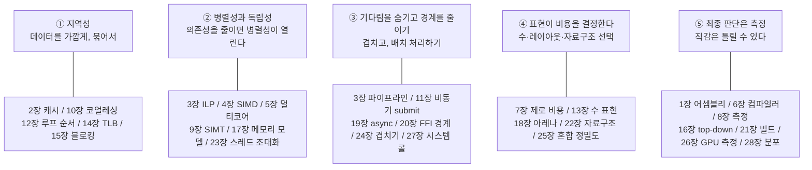

import RustPlay from '@components/RustPlay.astro';
import latency from '@snippets/ch28/latency.rs?raw';

이 장에서 알 수 있는 것:

- 지연 시간을 분포로 보는 방법 — 평균, 중앙값, 최악값은 서로 다른 정보를 줍니다
  (실측: 중앙값 70나노초, 최대 33밀리초)
- 측정을 왜곡하는 **coordinated omission**이라는 함정
- 성능 회귀를 막는 운영 방법 — 벤치마크 CI와 측정 안정화
- 이 책 28장을 관통하는 다섯 가지 원칙
- 왜 이 내용이 필요한가 — 성능 지식은 반복 가능한 운영 방식으로 바뀌어야 실제 프로젝트에 남습니다.
  개인의 감각을 팀과 시간에 견디는 프로세스로 만드는 것이 마지막 장의 목표입니다

## 지연 시간은 분포로 봐야 합니다

웹 애플리케이션의 성능은 대부분 **지연 시간**으로 이야기합니다.
이 용어는 [2장](/cpu/02-memory-hierarchy/)에서 메모리 지연으로 처음 등장했고,
여기에서는 서비스 응답 시간에 적용합니다.

가장 먼저 버려야 할 습관은 평균 하나만 보는 것입니다.
`HashMap`에 100만 번 삽입하면서 **각 삽입을 개별적으로** 측정해 분포를 보겠습니다.

<RustPlay code={latency} mode="release" title="100만 번 insert의 개별 지연 시간 분포" />

저자의 Playground 실측입니다.

```text
평균   :      152 ns
중앙값 :       70 ns
p99    :      260 ns
p99.9  :      470 ns
최대   : 33340370 ns  (33.3밀리초)
```

중앙값은 70나노초인데 최대값은 **33밀리초**, 중앙값의 약 47만 배입니다.
원인은 [22장](/rust-deep/22-data-structures/)에서 본 리해시입니다.
테이블을 더 크게 다시 만들고 모든 원소를 옮기는 순간 긴 지연이 생깁니다.

[7장](/rust-opt/07-zero-cost/)에서 다룬 상환(amortized) 비용 구조는
평균적으로는 저렴하지만 **지연 시간 분포의 꼬리를 두껍게 만들 수 있습니다**.
평균 152나노초만 보면 33밀리초의 정지 구간이 거의 보이지 않습니다.

그래서 실무에서는 **퍼센타일**(percentile)을 사용합니다.
p50은 중앙값, p99는 100번 중 약 한 번 수준의 느린 요청,
p99.9는 1000번 중 약 한 번 수준의 지연을 나타냅니다.

요청 하나가 내부적으로 m개의 다른 요청을 병렬로 호출한다고 생각해 보겠습니다.
각 호출이 p99 수준의 느린 상황을 피할 확률은 0.99^m이고,
하나라도 p99를 만날 확률은 `1 - 0.99^m`입니다.
m=50이면 약 40%이고 수백 개라면 대부분의 상위 요청이 하나 이상의 느린 하위 요청을 만나게 됩니다.
대규모 서비스의 SLO(service level objective)가 p99 계열로 정의되는 이유입니다.

:::note[coordinated omission — 느린 시간을 측정에서 지워 버리는 함정]
부하 테스트 도구가 "요청을 하나 보내고 응답을 받은 뒤 다음 요청을 보낸다"는 방식으로 동작하면 문제가 생길 수 있습니다.
서버가 33밀리초 멈춰 있는 동안 부하 생성기도 함께 기다리기 때문에,
그 시간에 실제 서비스라면 도착했을 수많은 요청이 아예 생성되지 않습니다.
결과적으로 긴 지연 구간의 요청 수가 기록에서 빠지고 p99가 실제보다 훨씬 좋아 보입니다.
이를 **coordinated omission**이라고 부릅니다.
대책은 응답 완료 시점이 아니라 예정된 도착 시각을 기준으로 일정한 요청률을 유지하는 부하 생성과,
HdrHistogram 계열처럼 이런 상황을 고려한 측정 방식을 사용하는 것입니다.
:::

## 변동의 원인 — 이 책 전체의 복습

"가끔 느리다"는 문제의 원인을 찾는 일은 지금까지 배운 하드웨어와 런타임 지식을 모두 사용하는 과정입니다.
p99가 비정상적으로 높다면 다음 항목들을 차례로 의심해 볼 수 있습니다.

| 원인 | 관련 장 |
| --- | --- |
| 리해시, `Vec` 재할당 | [7장](/rust-opt/07-zero-cost/), [22장](/rust-deep/22-data-structures/) |
| 큰 자료구조의 `drop`과 연쇄 해제 | [18장](/rust-deep/18-allocators/) |
| 할당자의 느린 경로와 단편화 | [18장](/rust-deep/18-allocators/) |
| 페이지 폴트와 최초 메모리 접근 | [14장](/cpu-deep/14-virtual-memory/) |
| async 런타임 안에 들어온 블로킹 코드 | [19장](/rust-deep/19-async/) |
| 락 경쟁과 거짓 공유 | [5장](/cpu/05-multicore/), [17장](/cpu-deep/17-memory-model/) |
| CPU/GPU 클록 변화와 열 스로틀링 | [21장](/rust-deep/21-build-control/), [26장](/gpu-deep/26-gpu-timing/) |
| 컨텍스트 스위치 뒤의 캐시·TLB 콜드 상태 | [27장](/systems/27-os-layer/) |

클라우드에서는 여기에 몇 가지 변수가 더해집니다.
많은 인스턴스의 vCPU는 [5장](/cpu/05-multicore/)에서 본 SMT의 논리 코어일 수 있어
물리 코어 하나의 전체 성능을 단독으로 쓰는 것과 다를 수 있습니다.
또 같은 물리 호스트의 다른 사용자와 캐시나 메모리 대역폭을 공유하면서 성능이 흔들리는
**noisy neighbor** 문제도 생길 수 있습니다.
공유 Playground에서 측정값이 자주 흔들렸던 이유도 이런 종류의 환경 변동과 관련됩니다.

## 성능 회귀 막기 — 벤치마크를 운영하기

성능도 기능처럼 **회귀**합니다.
겉보기에는 무해한 리팩터링이 인라이닝([6장](/rust-opt/06-compiler/))을 막을 수 있고,
의존성 업데이트 하나로 힙 할당 횟수가 늘어날 수도 있습니다.
따라서 기능 테스트처럼 성능도 지속적으로 확인하는 장치가 필요합니다.

- **벤치마크를 CI에 포함합니다** — criterion([8장](/rust-opt/08-measure/))은 기준 측정과 비교할 수 있으며,
  [critcmp](https://github.com/BurntSushi/critcmp) 같은 도구로 차이를 확인할 수 있습니다
- **시간 대신 명령어 수를 측정하는 방법도 있습니다** — 공유 CI 러너는 벽시계 시간이 많이 흔들립니다.
  [iai-callgrind](https://github.com/iai-callgrind/iai-callgrind)는 실행 명령 수와 캐시 관련 지표를 시뮬레이션 기반으로 측정해
  환경 잡음이 큰 곳에서도 회귀를 비교적 안정적으로 찾을 수 있습니다.
  실제 시간 대신 "얼마나 많은 일을 했는가"를 고정점으로 보는 방법입니다
- **단발성 작은 차이에 과민하게 반응하지 않습니다** — 예를 들어 한 번의 5% 차이는 잡음으로 보고,
  여러 번 반복해서 3% 정도 악화가 계속되면 조사하는 식으로 운영할 수 있습니다.
  정확한 기준은 CI 환경의 변동 폭에 맞춰 정해야 합니다
- **프로파일을 정기적으로 비교합니다** — 한 달에 한 번이라도 플레임 그래프([8장](/rust-opt/08-measure/))를 비교하면
  어느 함수가 서서히 커지고 있는지 조기에 발견할 수 있습니다

팀의 문화로는 **성능 주장에는 숫자를 붙이는 것**이 중요합니다.
"이 변경으로 빨라질 것 같다"는 PR이라면 측정 전후 결과를 함께 남깁니다.
이 책에서 반복한 "저자의 실측에서는"이라는 태도를 코드 리뷰 과정에 가져오는 것입니다.

## 지식의 지도

마지막으로 28장의 내용을 다섯 가지 원칙으로 묶어 보겠습니다.
다음 그림은 주요 장만 연결한 전체 지도입니다.



**① 지역성.** 캐시, TLB, GPU 코얼레싱은 모두 같은 원칙을 공유합니다.
빠른 메모리는 작으므로 자주 사용할 데이터를 가깝게 모으고 연속적으로 접근해야 합니다.
이 책에서 92배, 13배처럼 큰 차이를 만든 경우의 상당수가 지역성 문제였습니다.

**② 병렬성과 독립성.** ILP, SIMD, 멀티코어, GPU까지 현대 계산 성능은 대부분 병렬성에서 나옵니다.
그 병렬성을 열어 주는 핵심은 의존성을 줄이고 서로 독립적인 작업을 만드는 것입니다.

**③ 기다림을 숨기고 경계를 줄이기.** 파이프라인, async, GPU 작업 겹치기, 시스템 콜 배치 처리는
모두 기다리는 시간을 다른 일과 겹치거나 경계 왕복 횟수를 줄이는 방법입니다.
대기 시간 자체를 없앨 수 없더라도 노출되는 시간을 줄일 수 있습니다.

**④ 표현이 비용을 결정합니다.** 같은 의미를 가진 데이터라도 숫자 형식, 메모리 레이아웃, 자료구조에 따라 성능이 크게 달라집니다.
추상화 자체는 제로 비용일 수 있어도 어떤 표현을 선택했는지는 무료가 아닙니다.

**⑤ 최종 판단은 측정입니다.** 앞의 네 원칙을 적용한 결과가 실제로 나아졌는지는 측정만이 알려 줍니다.
이 책에서도 23장의 reduction과 21장의 PGO처럼 예상과 다른 결과가 여러 번 나왔습니다.

이 다섯 가지 원칙은 CPU, GPU, OS뿐 아니라 앞으로 나올 다른 하드웨어에도 적용할 수 있습니다.
캐시 크기나 워프 폭 같은 구체적인 숫자는 세대마다 바뀌지만,
문제를 보는 원칙과 이를 검증하는 방법은 오래 남습니다.

## 정리

- 지연 시간은 분포로 봐야 합니다. 실험에서 평균은 152ns였지만 최대값은 33ms였습니다.
  실무에서는 p99 같은 퍼센타일과 SLO가 중요한 언어입니다
- 부하 테스트에서는 coordinated omission을 주의해야 합니다.
  응답을 기다린 뒤 다음 요청을 보내는 방식은 가장 느린 구간의 요청을 측정에서 지워 버릴 수 있습니다
- 가끔 발생하는 긴 지연의 원인은 리해시, drop, 페이지 폴트, 블로킹 코드, 클록 변동, noisy neighbor처럼 이 책 여러 장에 흩어져 있습니다
- 성능도 회귀합니다. criterion이나 iai-callgrind를 CI에 연결하고 성능 개선 주장에는 전후 측정값을 남기는 습관이 필요합니다
- 전체 28장은 지역성, 병렬성, 기다림과 경계, 표현, 측정이라는 다섯 원칙으로 묶을 수 있습니다.
  세부 하드웨어 수치는 바뀌어도 이 원칙은 오래 유지됩니다

## 책을 다 읽은 뒤

이 책의 모든 실측은 저장소의 `src/snippets/`와 `examples/`에서 다시 실행할 수 있습니다.
자신의 환경에서 같은 코드를 실행하고 수치가 어떻게 달라지는지 확인하는 것 자체가
다섯 번째 원칙인 "측정"을 직접 실천하는 과정입니다.

더 공부할 자료는 [더 배우려면](/appendix/resources/)을,
용어가 필요할 때는 [용어집](/appendix/glossary/)을 참고하세요.

좋은 측정과 좋은 설계를 이어가세요.